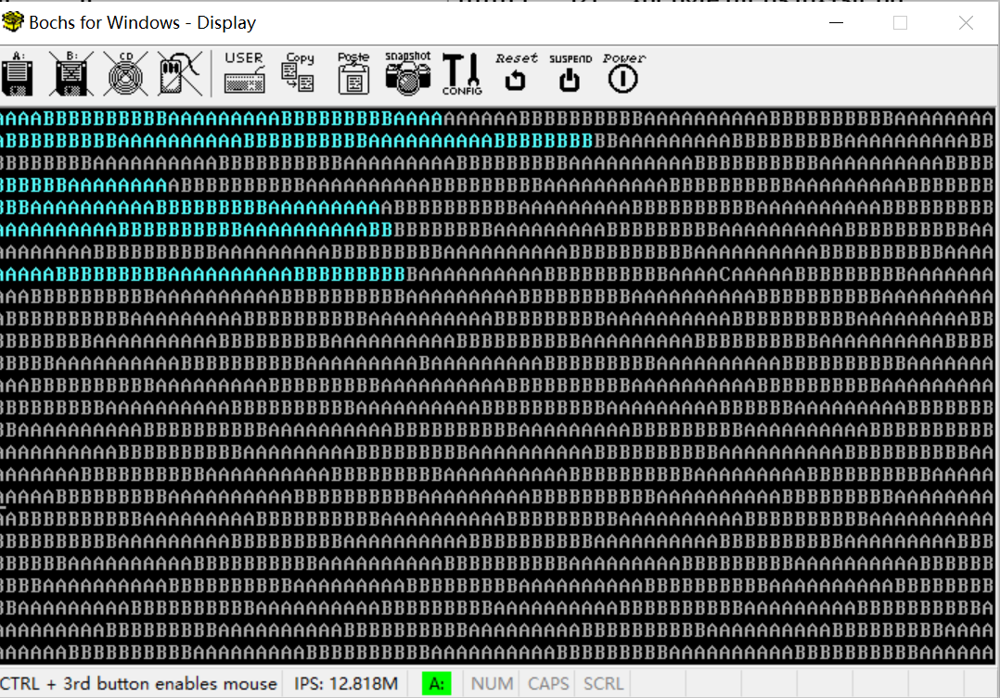
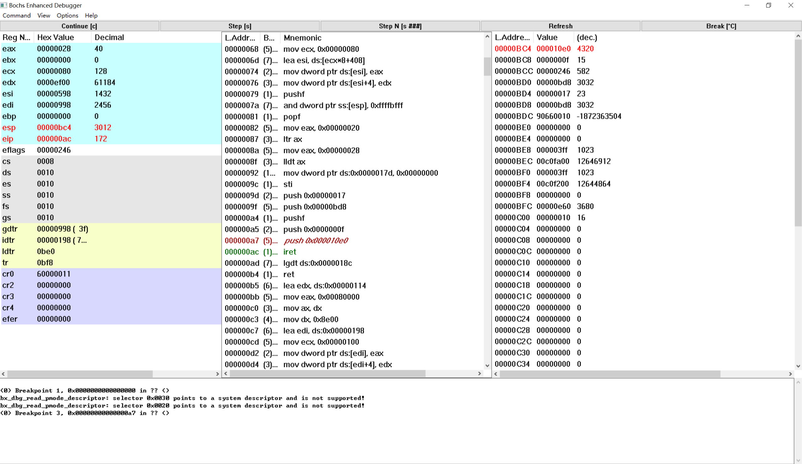
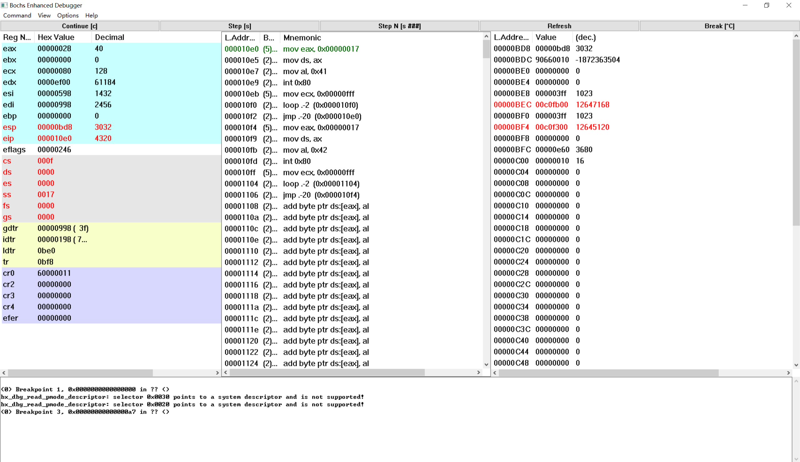
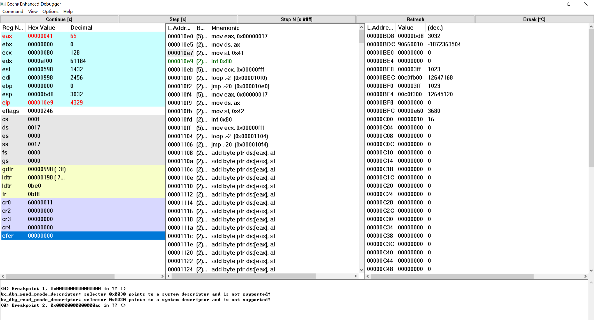
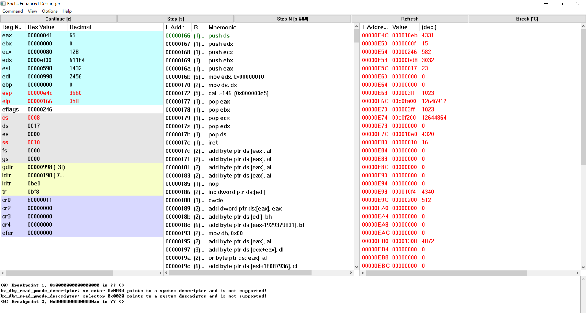

## 实验报告

通过仔细的调试与跟踪程序，完成以下任务：

1. 请简述` head.s `的工作原理

   具体分为以下几步：

   1. 首先通过boot.s设置的GDT来加载数据段寄存器ss（好的习惯），并且设置堆栈指针esp；接着通过setup_idt和setup_gdt设置IDT、GDT表并重新设置所有段寄存器，完成初始化；

   2. 然后设置8253定时芯片，把计数器通道 0 设置成每隔 10 毫秒向中断控制器发送一个中断请求信号；

   3. 接着在 IDT 表第 8 和第 128项处分别设置定时中断门描述符（通过上面设置的定时芯片来触发）和系统调用陷阱门描述符（用于task0和task1来打印字符），以便在执行task0和task1的时候使用；

   4. 最后在堆栈中人工建立中断返回时的场景，直接返回到task0，然后通过定时中断交替执行task0（在控制台打印字符A）和task1（在控制台打印字符B），如下图所示。

      

2. 请记录 head.s 的内存分布状况，写明每个数据段，代码段，栈段的起始与终止的内存地址

   通过bochs观察内存分布情况，得出如下结果：

|     代码段名称     |   起始地址  |         终止地址          |
| :--------------: | :--------: | :----------------------: |
|    startup_32    |    0x00    |           0xac           |
|    setup_gdt     |    0xad    |           0xb4           |
|    setup_idt     |    0xb5    |           0xcd           |
|      rp_idt      |    0xd2    |           0xe4           |
|    write_char    |    0xe5    |          0x113           |
|    ignore_int    |   0x114    |          0x129           |
| timer_interrupt  |   0x12a    |          0x165           |
| system_interrupt |   0x166    |          0x17c           |
|      task0       |   0x10e0   |          0x10f3          |
|      task1       |   0x10f4   |          0x1107          |

|      数据段名称      | 起始地址 |        终止地址        |
| :----------------: | :----------: | :------------------------: |
|     current      |   0x17d    |          0x180           |
|     scr_loc      |   0x181    |          0x184           |
|   lidt_opcode    |   0x186    |          0x18b           |
|   lgdt_opcode    |   0x18c    |          0x191           |
|       idt        |   0x198    |          0x997           |
|       gdt        |   0x998    |          0x9d7           |
|       ldt0       |   0xbe0    |          0xbf7           |
|       tss0       |   0xbf8    |          0xc5f           |
|       ldt1       |   0xc60    |          0xe77           |
|       tss1       |   0xe78    |          0xedf           |

|      堆栈段名称      | 起始地址 |        终止地址        |
| :----------------: | :----------: | :------------------------: |
|    init_stack（task0的用户栈，也是一开始初始化用的栈）    |   0xbd8   |  0x9d9  |
|     krn_stk0（task0的内核栈）     |   0xe60   |  0xc61  |
|     krn_stk1（task1的内核栈）     |   0x10e0   | 0xe01 |
|    user _stk1（task1的用户栈）    |   0x1308   | 0x1109 |

3. 简述 head.s 57 至 62 行在做什么？

   首先在上一行（56行）开中断，为的是让62行能执行中断返回指令，从而切换到特权级3的任务0中执行；57到61行依次将任务0的局部空间数据段选择符、堆栈指针、标志寄存器、局部空间代码段选择符、代码指针入栈，以便在62行执行中断返回的时候弹出，执行和恢复现场类似的过程。

4. 简述 iret 执行后， pc 如何找到下一条指令？

   由于前面向栈中压入了局部空间代码段选择符和代码指针的值，于是iret从栈中弹出cs和eip的值，进而pc指向cs:eip，也就是task0第一行代码所在的位置，找到task0的第一条指令开始执行。

5. 记录 iret 执行前后，栈是如何变化的？

   iret执行前：

   

   iret执行后：

    

   从上面两张图可以看出，栈中刚刚压入的五个内容出栈，即task0的局部空间数据段选择符、堆栈指针、标志寄存器、局部空间代码段选择符、代码指针，引起esp，eip，eflags，cs，ss的改变。

6. 当任务进行系统调用时，即 int 0x80 时，记录栈的变化情况。

   进行系统调用前：

    

   进行系统调用后：

   
   
   此时发现task0切换到内核模式，也就是从特权级3到特权级0，此时task0从用户栈切换到内核栈。与此同时将task0的局部空间数据段选择符、堆栈指针、标志寄存器、局部空间代码段选择符、代码指针压入task0的内核栈，以便在执行iret指令时从内核模式切换到用户模式，将五个数出栈给esp，eip，eflags，cs，ss赋值。

