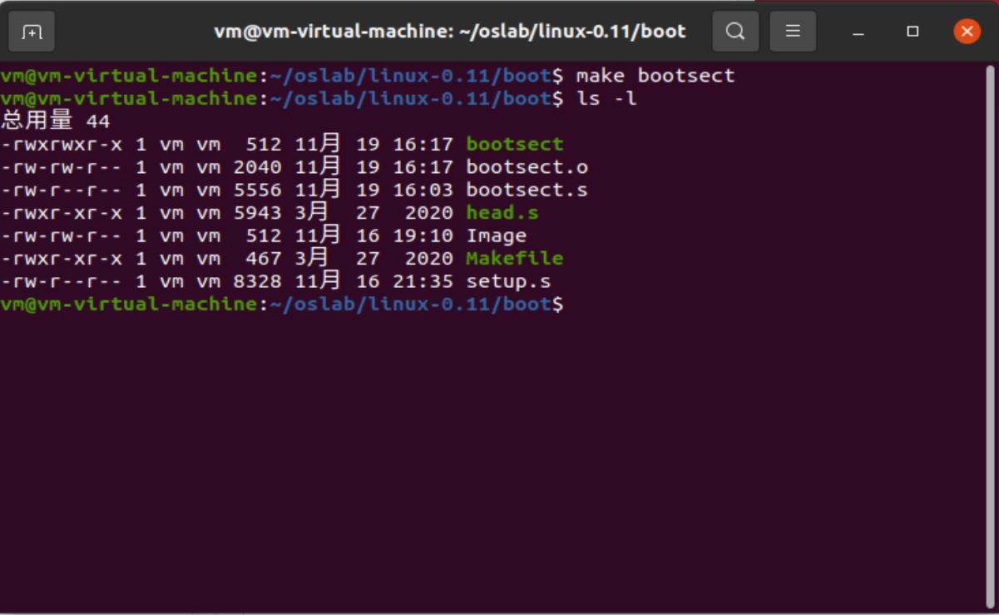
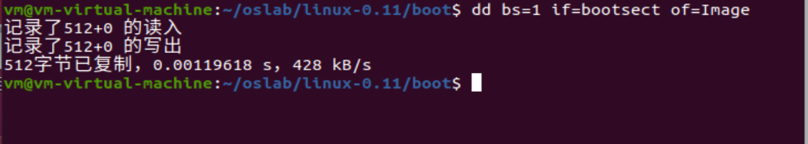
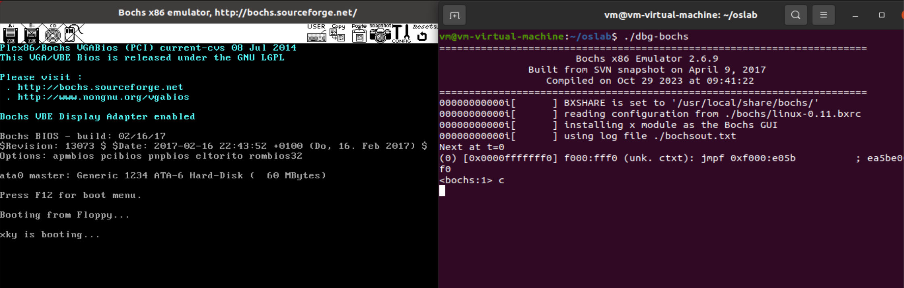
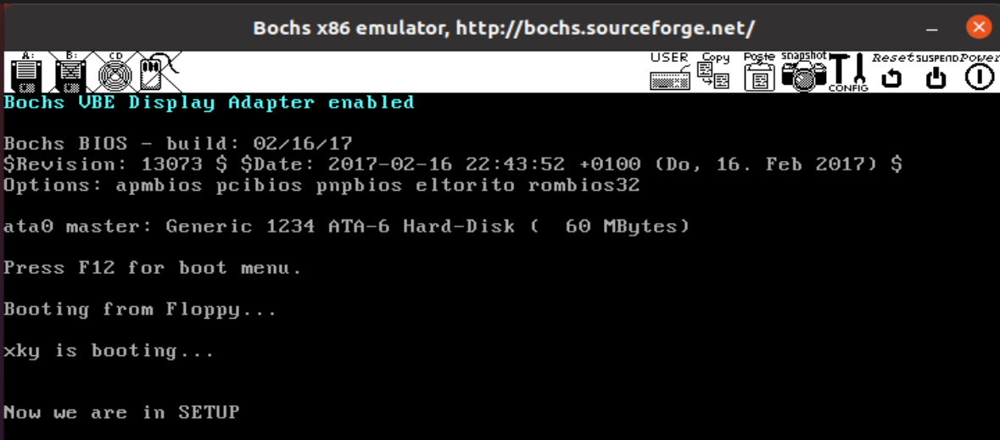
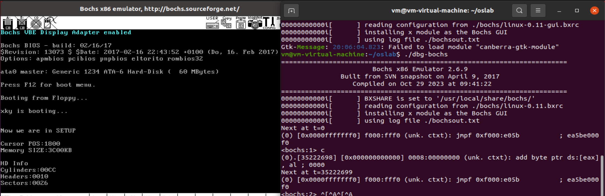
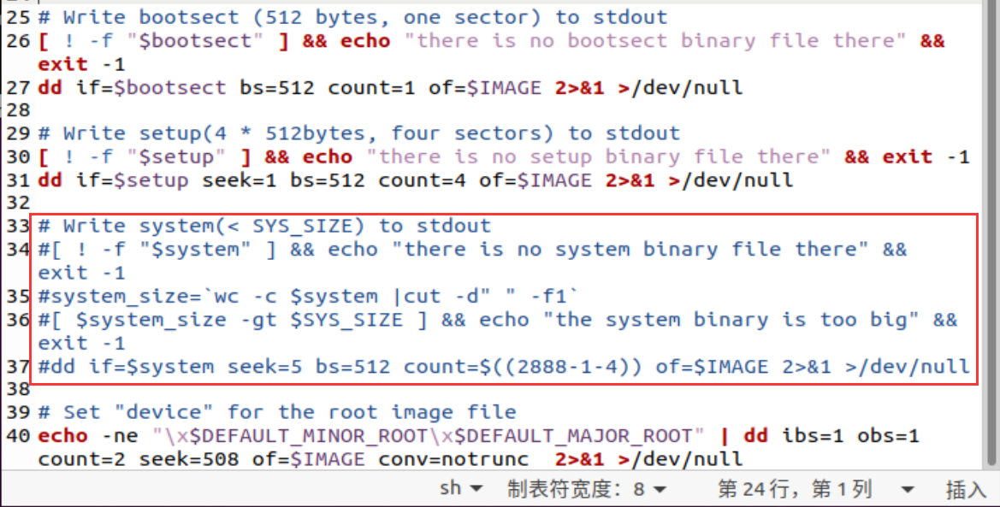

# 3. 操作系统的引导

## 3.1. 实验目的

- 熟悉实验环境；
- 建立对操作系统引导过程的深入认识；
- 掌握操作系统的基本开发过程；
- 能对操作系统代码进行简单的控制，揭开操作系统的神秘面纱。

## 3.2. 实验内容

1. 阅读《Linux内核完全注释》的第 `6` 章，对计算机和 `Linux 0.11` 的引导过程进行初步的了解；
2. 按照下面的要求改写 `Linux 0.11` 的引导程序 `bootsect.s` ;
3. 有兴趣同学可以做做进入保护模式前的设置程序 `setup.s` 。

### 3.2.1. 改写 `bootsect.s` 主要完成如下功能：

**要求：**`bootsect.s` 能在屏幕上打印一段提示信息

```
XXX is booting...
```

其中 `XXX` 是你给自己的操作系统起的名字，也可以显示一个特色 `logo` ，以表示自己操作系统的与众不同。

**改写步骤：**

首先我们在bootsect.s文件中找到msg1的位置，然后将其中的'loading system...'改为'xky is booting...'，如下所示：

```assembly
msg1:
	.byte 13,10
	.ascii "xky is booting..."
	.byte 13,10,13,10
```

其中'xky is booting...'是我们要打印的提示信息。

由于在向屏幕打印提示信息时我们要向int $0x10 中断传送要打印的字符串长度，所以接下来我们要修改传入的参数。由于回车换行算两个字符，所以三个回车换行一共有6个字符。通过手动计数可知，这里要传入的参数为23，所以修改如下。

```assembly
# Print some inane message

	mov	$0x03, %ah		# read cursor pos
	xor	%bh, %bh
	int	$0x10
	
	mov	$23, %cx
	mov	$0x0007, %bx		# page 0, attribute 7 (normal)
	#lea	msg1, %bp
	mov     $msg1, %bp
	mov	$0x1301, %ax		# write string, move cursor
	int	$0x10
```

接下来我们开始编译bootsect.s。由于网站上的命令存在些许的问题，所以我们在这里直接查看makefile文件，并用相关的指令进行编译。

在这里我们使用的指令如下：

```makefile
make bootsect
ls -l			# 查看信息
```



可以看到通过make指令，bootsect已经是512字节了，说明文件头已经被去掉了。所以我们在将bootsect转化为Image文件时就不用跳过32个字节了，如下图所示：



接着我们将Image文件拷贝到 `linux-0.11` 目录下，然后使用bochs运行Image文件，如下图所示：



可以看到提示信息打印成功。

### 3.2.2. 改写 `setup.s` 主要完成如下功能：

要求如下：

1. `bootsect.s` 能完成 `setup.s` 的载入，并跳转到 `setup.s` 开始地址执行。而 `setup.s` 向屏幕输出一行

```
Now we are in SETUP
```

2. `setup.s` 能获取至少一个基本的硬件参数（如内存参数、显卡参数、硬盘参数等）， 将其存放在内存的特定地址，并输出到屏幕上。

3. `setup.s` 不再加载Linux内核，保持上述信息显示在屏幕上即可。

改写如下：

1. 第一个要求的改写：

   由于有上一个实验的铺垫，这里我们就仿照bootsect.s自己编写相关代码，msg1信息如下所示：

   ```assembly
   msg1:
   	.byte 13,10
   	.ascii "Now we are in SETUP"
   	.byte 13,10,13,10
   ```

   这里我们将信息改成了'Now we are in  SETUP'。

   打印msg1的代码如下所示：

   ```assembly
   	mov	%cs, %ax
   	mov	%ax, %es	# 设置附加段
   	
   	mov	$0x03, %ah	# read current cursor
   	xor	%bh, %bh
   	int	$0x10
   	
   	mov	$25, %cx	# 设置字符串长度
   	mov	$0x0007, %bx		
   	mov	$msg1, %bp
   	mov	$0x1301, %ax		
   	int	$0x10
   ```

   首先我们要将es段设置为cs，因为系统要通过es段来找到msg1的位置。接着读取当前指针位置，以便接下来打印字符，最后调用int $0x10中断，在屏幕上打印字符。

   然后使用make命令编译文件，在bochs中结果如下：

   

2. 第二个要求的改写：

   在原先的setup.s中已经完成了将硬件参数存放到内存中的步骤，接下来我们要做的就是将硬件参数输出到屏幕上，具体函数如下所示：

   ```assembly
   # 以16进制方式打印栈顶的16位数
   print_hex:
   	mov %bx, %cx	# 对源代码进行了改进，可以传入需要打印参数的长度
   	mov %ax, %dx	# 这里我们直接将参数取出来放到ax中再传给dx
   print_digit:
   	rol $4, %dx		# 取dx的高4比特移到低4比特处
   	mov $0xe0f, %ax	# ah = 请求的功能值，al = 半字节(4个比特)掩码。
   	and %dl, %al	# 取dl的低4比特值。
   	add $0x30, %al	# 给al数字加上十六进制0x30
   	cmp $0x3a, %al
   	jl outp			# 是一个不大于十的数字
   	add $0x07, %al	# 是a～f，要多加7
   outp:
   	int $0x10
   	loop print_digit
   	ret
   
   # 打印回车换行
   print_nl:
   	mov $0xe0d, %ax
   	int $0x10
   	mov $0x0a, %al
   	int $0x10
   	ret
   ```

   其中在print_hex函数中我们对原来的代码进行了改进，在这里我们可以通过%bx来传入需要打印的参数的长度，同时直接将需要打印的参数放到了%ax中，不用在函数中寻址查找参数。接下来利用print_digit来将二进制数转化为十六进制数打印，最后通过outp来调用int 0x10打印数字并循环打印参数。

   而print_nl函数用来打印回车和换行，这样相比直接打印回车和换行更加简洁明了。

   准备工作做完了以后，接下来我们开始打印参数，以下先展示一个具体的示例：

   ```assembly
   # set ds and es
   	mov	$INITSEG, %ax
   	mov	%ax, %ds
   	mov	%cs, %ax
   	mov	%ax, %es
   
   # print cursor
   # read current cursor
   	mov	$0x03, %ah
   	xor	%bh, %bh
   	int	$0x10
   
   # write string
   	mov	$11, %cx
   	mov	$0x0007, %bx
   	mov	$cur_msg, %bp
   	mov	$0x1301, %ax
   	int	$0x10
   
   	mov	%ds:0, %ax
   	mov	$0x4, %bx
   	call	print_hex
   	call	print_nl
   ```

   首先为了获取参数，我们需要设置ds段和es段，ds段用来寻找参数信息，而es用来寻找打印的字符串的位置。
   
   这里我们先读取当前指针所在位置，为下面打印参数做准备，接着在屏幕上显示我们预先准备好的字符串，接着通过读取%ds:0来获取参数，且参数长度为4，然后调用print_hex函数打印十六进制数并打印回车换行符，这样就完成了参数打印。
   
   最终的结果如下图所示：
   
   
   
   可以通过比对事先设置的参数，发现是一样的。

3. 第三个要求的改写

   为了让linux不在加载内核，我们只需在build.sh中将system的部分全部注释掉就可以了，如下图所示：

   

   这样在执行过程中就不在加载linux内核了。

## 3.3. 实验报告

在实验报告中回答如下问题：

1. 有时，继承传统意味着别手蹩脚。 `x86` 计算机为了向下兼容，导致启动过程比较复杂。 请找出 `x86` 计算机启动过程中，被硬件强制，软件必须遵守的两个“多此一举”的步骤（多找几个也无妨），说说它们为什么多此一举，并设计更简洁的替代方案。

   实模式和保护模式之间的转换：

   以前x86处理器以实模式运行，这是陈旧的工作模式，而现代操作系统都是采用保护模式，它提供更强大和安全的特性，更为先进。为了向下兼容，x86计算机启动时必须以实模式启动，接着切换成保护模式，这增加了启动的复杂性。

   **替代方案：**直接从启动时开始在保护模式下运行，省略实模式和保护模式的切换，以简化启动过程。

   引导扇区的搬运：

   计算机上电以后，在BIOS运行之后会将引导扇区放到内存的0x7c00处，但为了之后程序的运行需要将这段代码进行搬运，徒增麻烦。

   **替代方案：**扩大实模式下可访问的地址空间，直接将bootsect加载到内存靠后的位置，这样就可省去后移的操作。