## 实验报告
通过仔细的调试与跟踪程序，完成以下任务：

1. 当执行完 system_interrupt 函数，执行 153 行 iret 时，记录栈的变化情况。

   执行前栈：

   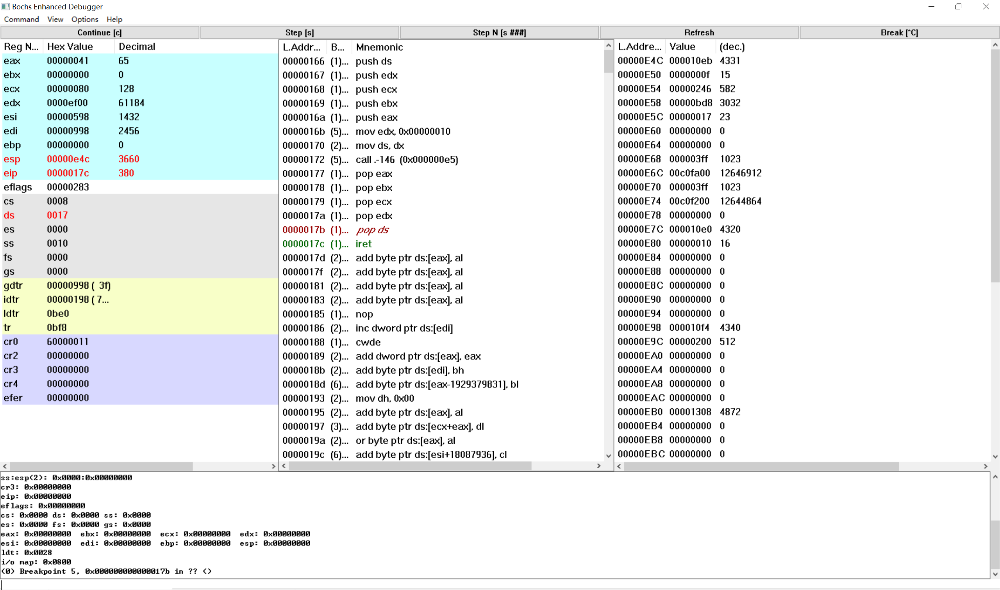

   执行后栈：

   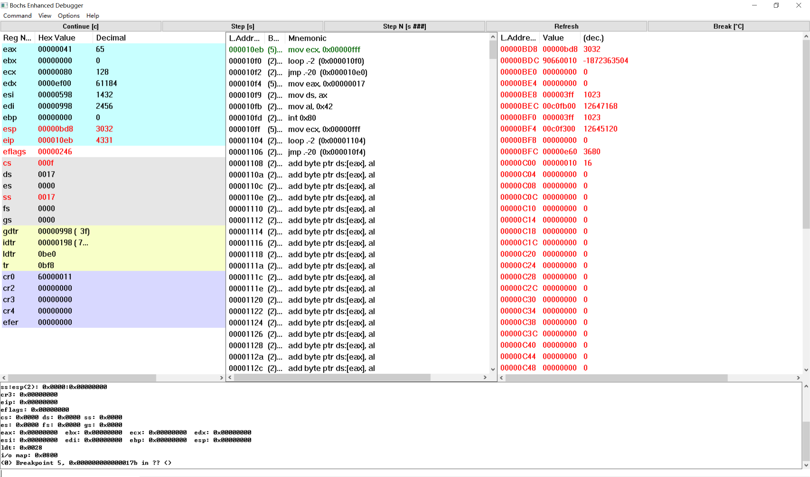

   可以发现ss、cs、eflags、eip、esp发生了变化，正好对应内核栈弹出的五个值，因此此时栈也从内核栈切换成了用户栈。

2. 当进入和退出 system_interrupt 时，都发生了模式切换，请总结模式切换时，特权级是如何改变的？栈切换吗？如何进行切换的？

   进入system_interrupt时，此时发现task0切换到内核模式，也就是从特权级3到特权级0，此时task0从用户栈切换到内核栈。与此同时将task0的局部空间数据段选择符、堆栈指针、标志寄存器、局部空间代码段选择符、代码指针压入task0的内核栈，也就是保护现场，以便在执行iret指令时从内核模式切换到用户模式。

   退出system_interrupt时，此时发现task1切换到用户模式，也就是从特权级0到特权级3，此时task0从内核栈切换到用户栈。这个过程是通过出栈来实现的，也就是在执行iret时恢复现场，内核栈中压入的局部空间数据段选择符、堆栈指针、标志寄存器、局部空间代码段选择符、代码指针出栈，引起cs、ss、eflags、eip、esp的改变，完成从内核栈到用户栈的转变。

3. 当时钟中断发生，进入到 timer_interrupt 程序，请详细记录从任务 0 切换到任务 1 的过程。

   首先进入timer_interrupt程序，设置断点，如下图所示：

   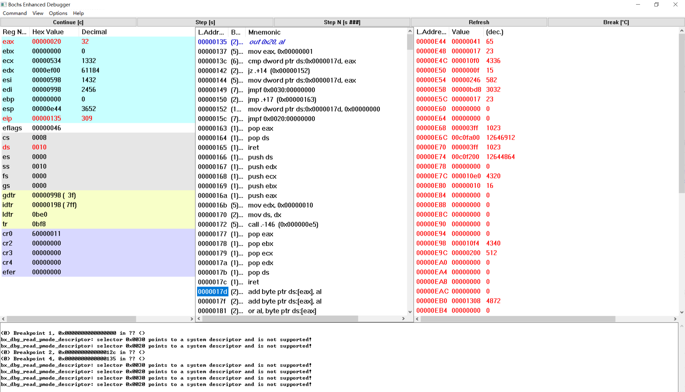

   接着我们查看一下此时内存中current的值；

   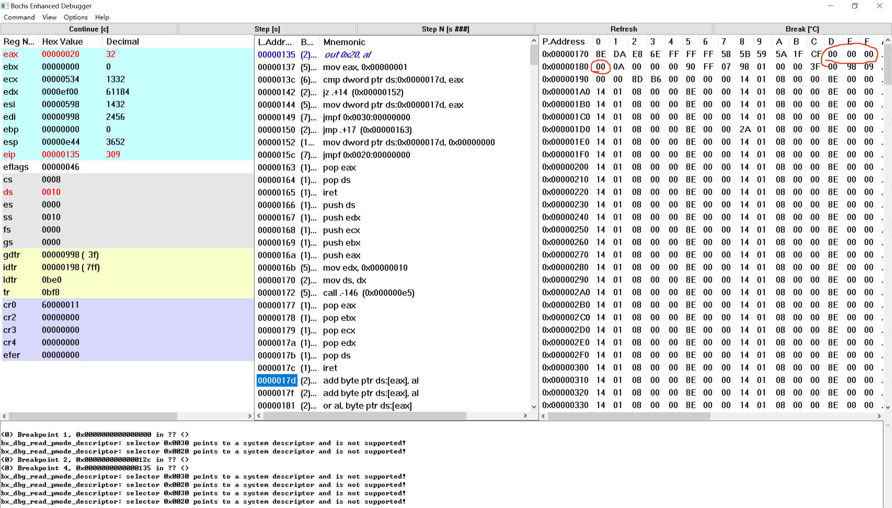

   可以发现，此时从0x17d开始的四个字节值为00 00 00 00，也就是current=0，当前处于task0中。接着执行程序；

   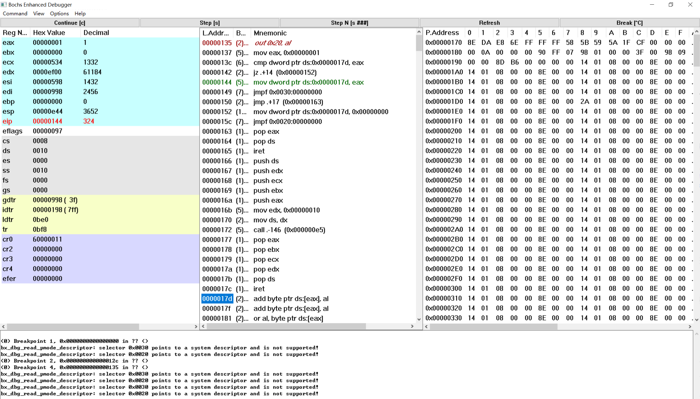

   由于current!=1，于是程序在0x142行没有发生跳转，而是继续向下运行，将current的值改为eax，也就是1，说明接下来要切换到任务1；接着通过任务1的tss跳转到任务1的代码处，也就是0x10f4处，如下图所示；

   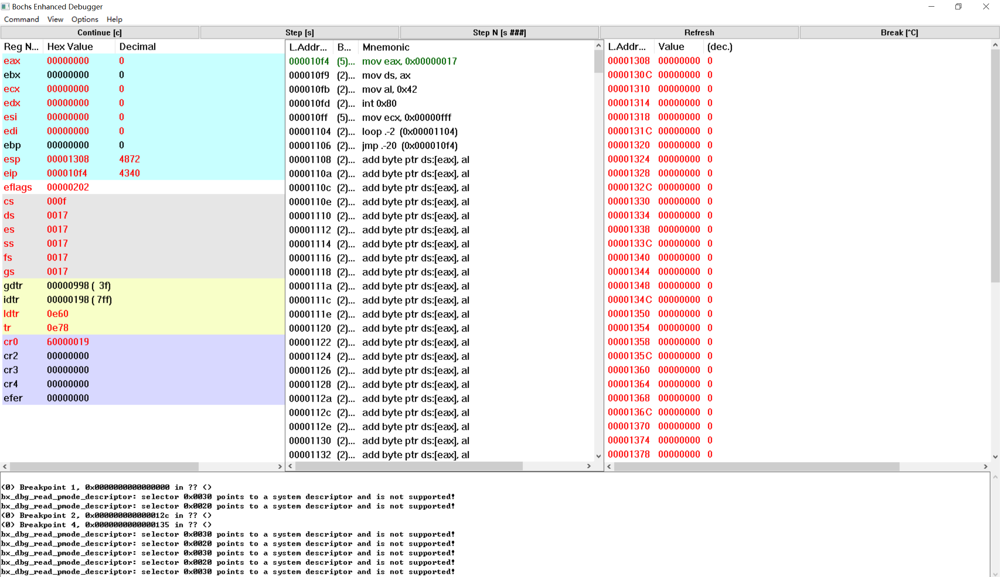

   这样任务0就通过timer_interrupt程序切换到任务1，继续向下执行了。

4. 又过了 10ms ，从任务1切换回到任务 0 ，整个流程是怎样的？ TSS 是如何变化的？各个寄存器的值是如何变化的？

   整个流程与任务0切换到任务1大同小异。首先进入timer_interrupt程序，设置断点，如下图所示：

   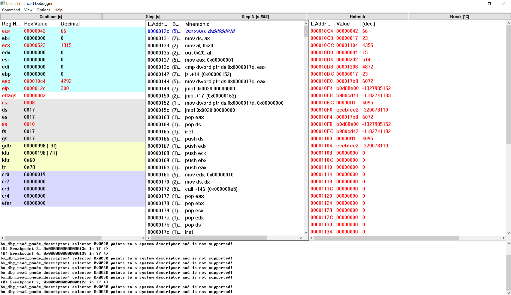

   接着我们查看一下此时内存中current的值；

   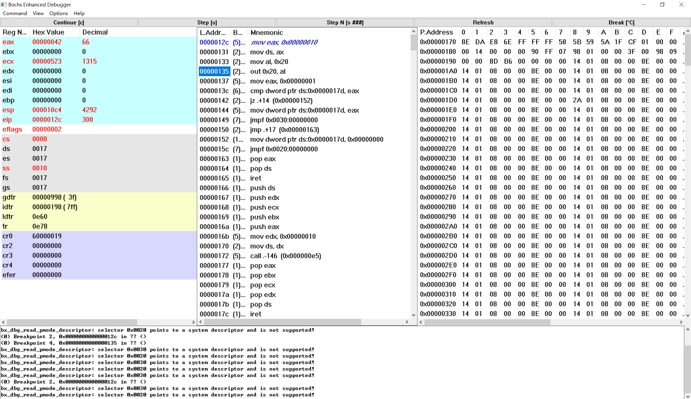

   可以发现，此时从0x17d开始的四个字节值为01 00 00 00，也就是current=1，当前处于task1中。接着执行程序；

   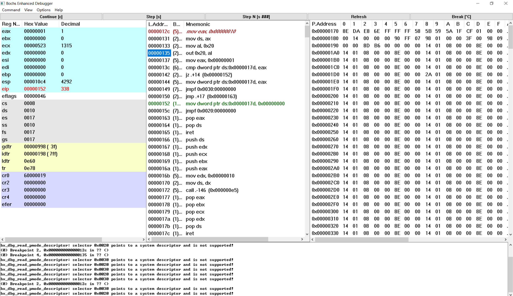

   由于current=1，于是程序在0x142行发生跳转，将current的值改为eax，也就是0，说明接下来要切换到任务0；接着通过任务0的tss跳转到任务0的代码处，也就是上次发生中断的地方0x10f0处，如下图所示；

   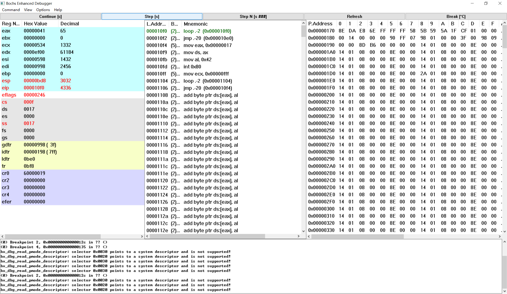

   这样任务1就通过timer_interrupt程序切换到任务0，继续向下执行了。

   tss的变化：

   任务切换前的tss：

   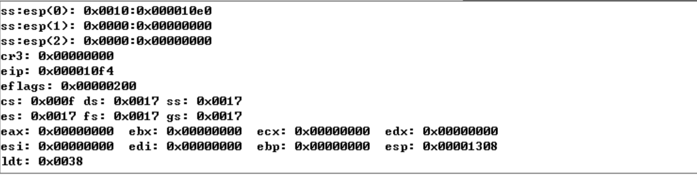

   可以看出任务切换前的tss为任务1的tss，因为此时tss中的cs:eip为0x0f:0x10f4，而这是task1的起始地址。

   接着运行到jmpf指令之前并查看此时的GDT，如下图所示：

   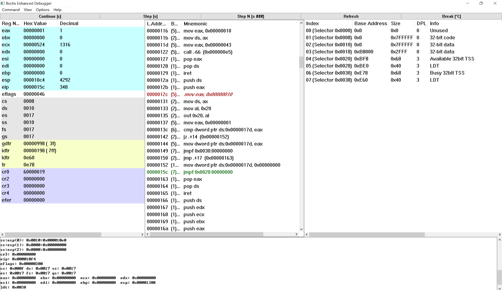

   可以看出0x20经过解释后就是GDT的第五项，也就是任务0的tss。

   接着我们观察一下从task0切换到task1之前task0的tss：

   

   可以发现，eip，eflags和cs的值都是0，说明这时还没有把task0的任务状态保存到tss里去。

   接着运行jmpf指令，并观察tss：

   

   可以发现tss切换成了task0的tss，此时cs:eip为0x08:0x150，eflags为0x97，这是task0上次发生任务切换时保存在tss中的，其它寄存器也在发生任务切换时将值保存在了tss里面，所以此时寄存器的变化如下图所示：

   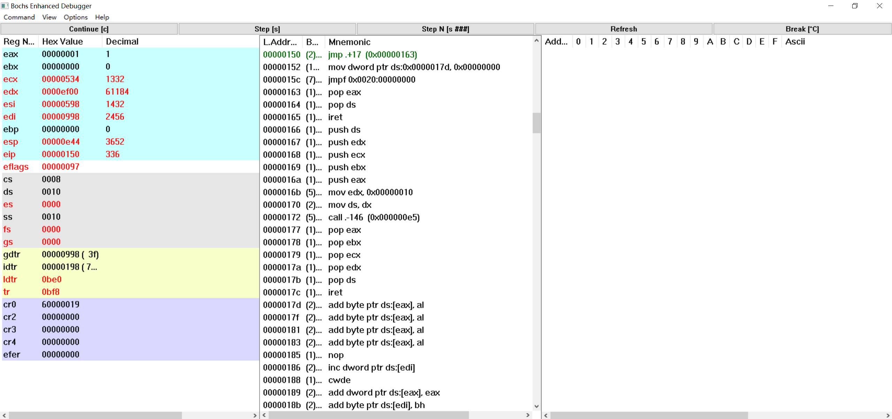

   可以发现所有的寄存器都替换为了任务0的tss的值，并且继续开始执行task0。

5. 请详细总结任务切换的过程。

   第一次切换：当定时芯片发送中断请求信号时（此时执行到任务0的loop处），任务0进入timer_interrupt程序，此时从0x17d开始的四个字节值为00 00 00 00，也就是current=0，由于current!=1，于是程序在0x142行没有发生跳转，而是继续向下运行；然后将current的值改为1，说明接下来要切换到任务1；接着通过任务1的tss跳转到任务1的代码处，并且在任务切换之前将所有寄存器的值保存到了任务0的tss中，这样任务0就通过timer_interrupt程序切换到任务1；

   第二次切换：当定时芯片发送中断请求信号时（此时执行到任务1的loop处），任务1进入timer_interrupt程序，此时从0x17d开始的四个字节值为01 00 00 00，也就是current=1，由于current=1，于是程序在0x142行发生跳转；然后将current的值改为0，说明接下来要切换到任务0；接着通过任务0的tss恢复任务0的所有寄存器，于是跳转到上次发生任务切换的地方，也就是jmpf的下一行，也就是cs:eip为0x08:0x150，还在timer_interrupt中，接着通过恢复现场恢复到任务0发生中断的地方，也就是loop处，继续运行task0。

   第三次切换：当定时芯片发送中断请求信号时（此时执行到任务0的loop处），任务0进入timer_interrupt程序，此时从0x17d开始的四个字节值为00 00 00 00，也就是current=0，由于current!=1，于是程序在0x142行没有发生跳转，而是继续向下运行；然后将current的值改为1，说明接下来要切换到任务1；接着在任务切换之前将所有寄存器的值保存到了任务0的tss中，恢复任务1的所有寄存器，于是跳转到上次发生任务切换的地方，也就是jmpf的下一行，也就是cs:eip为0x08:0x163，还在timer_interrupt中，接着通过恢复现场恢复到任务1发生中断的地方，也就是loop处，继续运行task1。
   
   接下来就是第二次切换和第三次切换交替执行，在控制台上循环打印A和B。