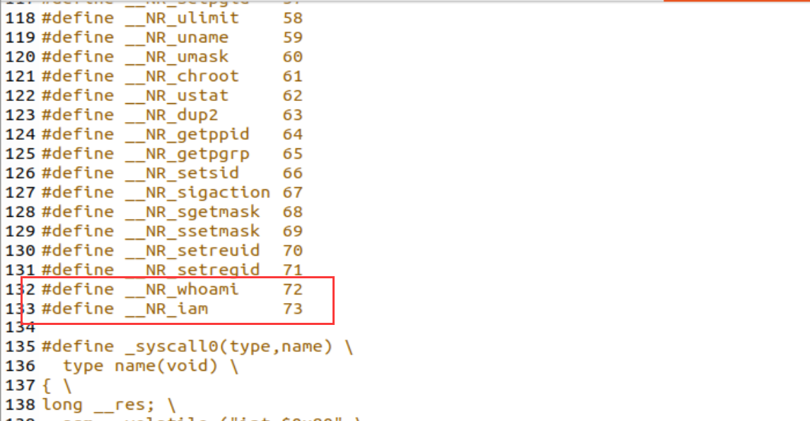
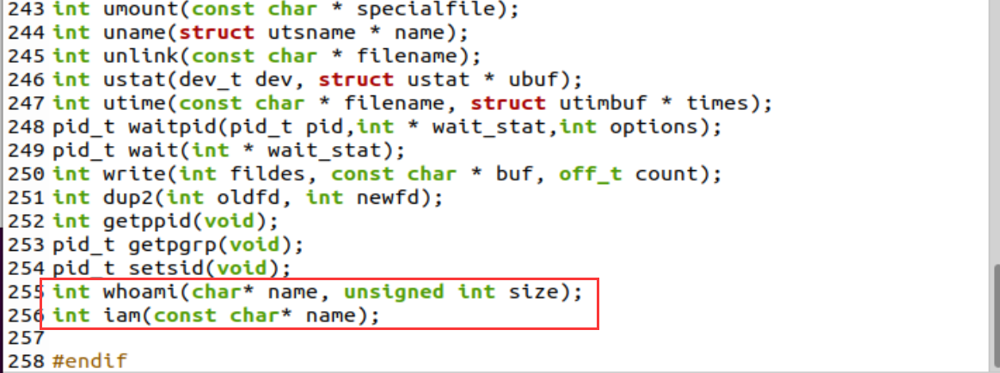
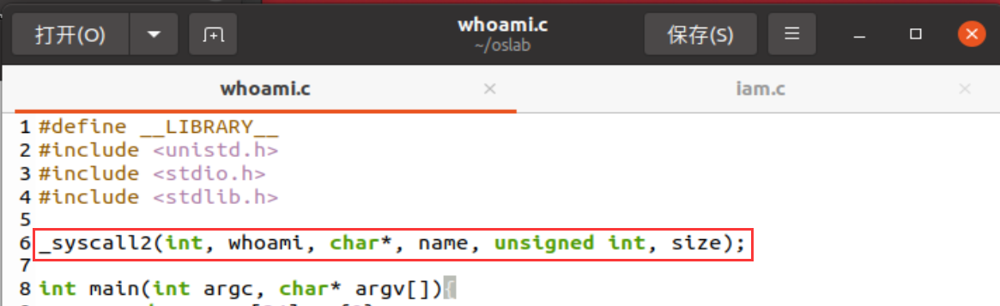
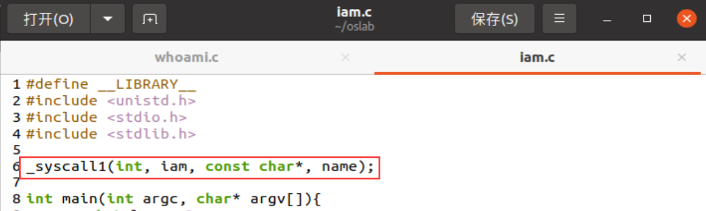
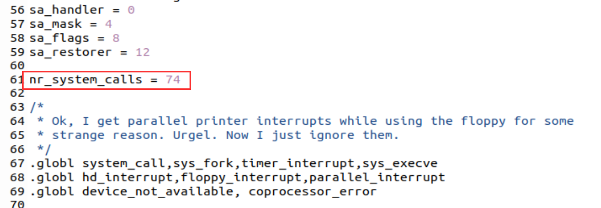
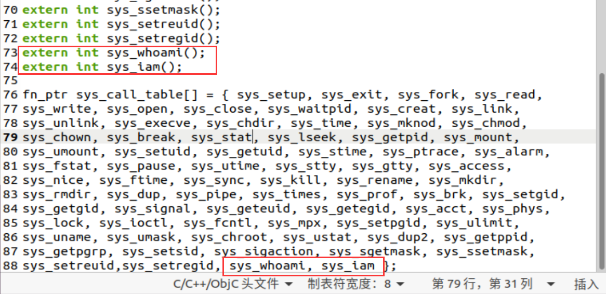
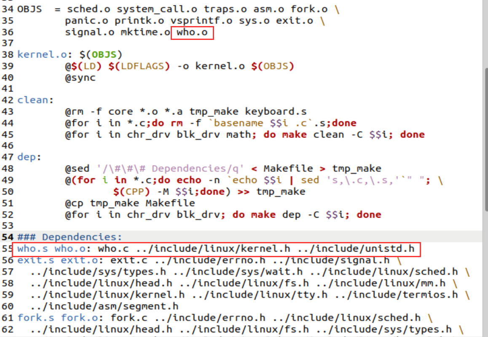
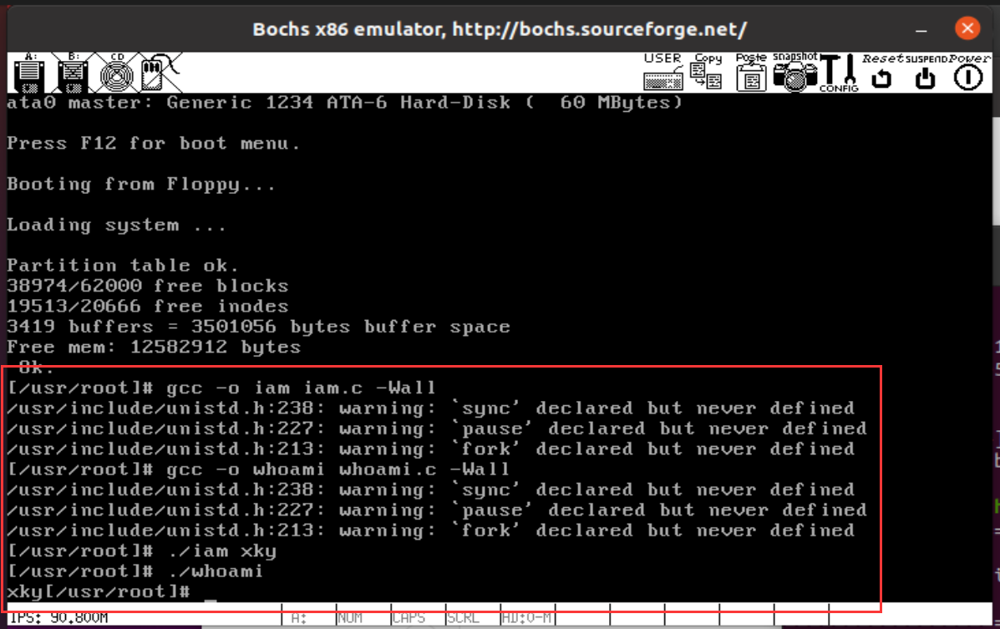
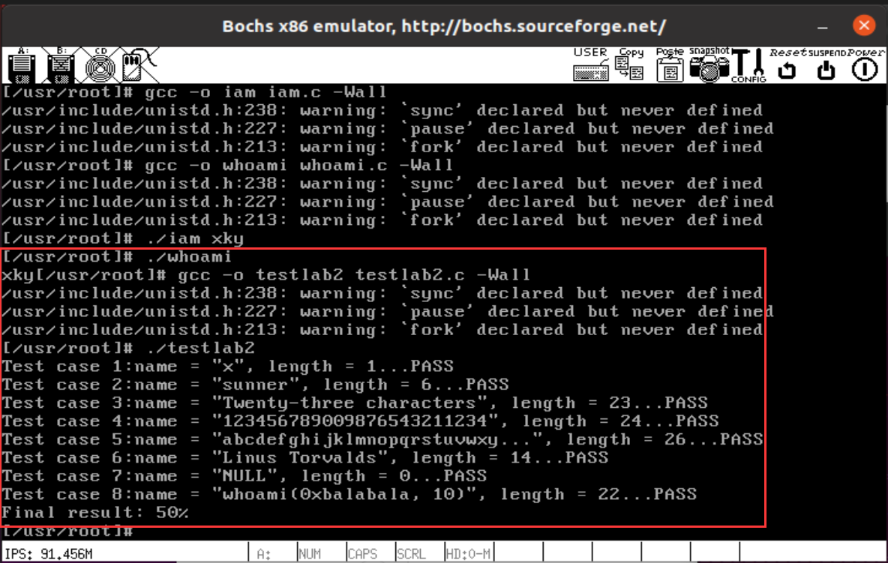
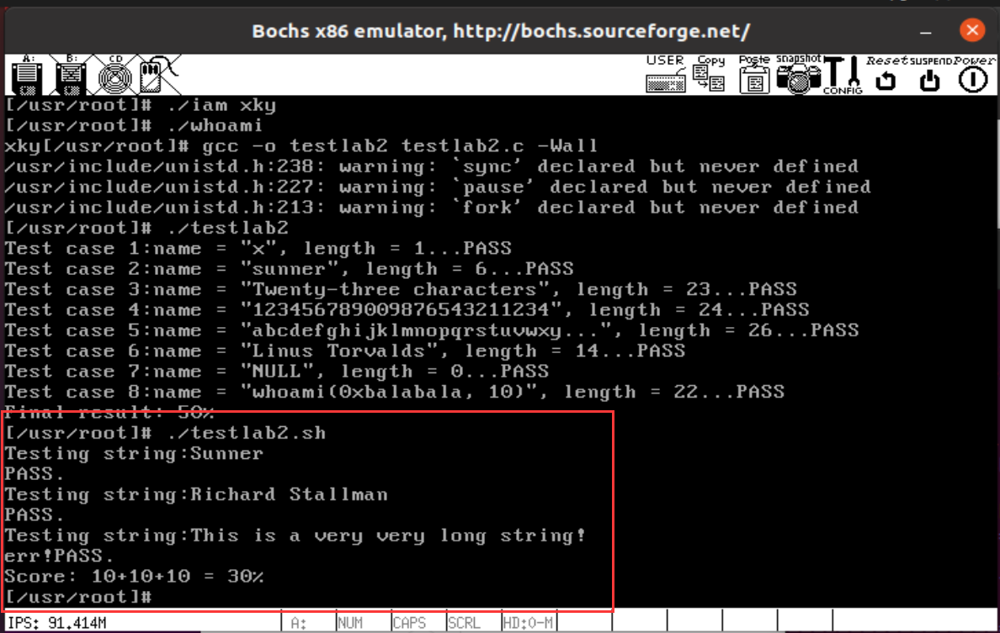

[toc]

# 4. 系统调用

## 4.1. 实验目的

- 建立对系统调用接口的深入认识
- 掌握系统调用的基本过程
- 能完成系统调用的全面控制
- 为后续实验做准备

## 4.2. 实验内容

此次实验的基本内容是：在 `Linux 0.11` 上添加两个系统调用，并编写两个简单的应用程序测试它们。

### 4.2.1. `iam()`

第一个系统调用是 `iam()` ，其原型为：

```
int iam(const char * name);
```

完成的功能是将字符串参数 `name` 的内容拷贝到内核中保存下来。 要求 `name` 的长度不能超过 `23` 个字符。返回值是拷贝的字符数。 如果 `name` 的字符个数超过了 `23` ，则返回 `-1` ，并置 `errno` 为 `EINVAL` 。

在 `kernal/who.c` 中实现此系统调用。

### 4.2.2. `whoami()`

第二个系统调用是 `whoami()` ，其原型为：

```
int whoami(char* name, unsigned int size);
```

它将内核中由 `iam()` 保存的名字拷贝到 `name` 指向的用户地址空间中， 同时确保不会对 `name` 越界访存（ `name` 的大小由 `size` 说明）。 返回值是拷贝的字符数。如果 `size` 小于需要的空间，则返回 `-1` ，并置 `errno` 为 `EINVAL` 。

也是在 `kernal/who.c` 中实现。

### 4.2.3. 测试程序

运行添加过新系统调用的 `Linux 0.11` ，在其环境下编写两个测试程序 `iam.c` 和 `whoami.c` 。最终的运行结果是：

```
./iam guojunos
./whoami
guojunos
```


## 4.3. 实验过程

1. 在 `Linux 0.11` 上添加两个系统调用，也就是iam()和whoami()。

   首先为了能在用户环境下调用系统调用iam()和whoami()，我们需要先修改 `include/unistd.h` 文件，使其包含 `__NR_whoami` 和 `__NR_iam` 以及相应的函数声明，如下图所示。

   

   

   同时在应用程序中还要有相应的接口函数，如下图所示。

   

   

   接着在`kernel/system_call.s` 中修改系统调用总数，如下图所示：

   

   为了增加实验要求的系统调用，需要在`include/linux/sys.h` 中的函数表中增加两个函数引用—— `sys_iam` 和 `sys_whoami` 。 当然该函数在 `sys_call_table` 数组中的位置必须和 `__NR_xxxxxx` 的值对应上。 同时还要仿照此文件中前面各个系统调用的写法，加上这两个函数，如下图所示。

   

   最后我们还需要修改 `kernel/Makefile`，如下图所示：

   
   
   who.c的代码如下所示：
   
   ```c
   #include <errno.h>
   #include <linux/kernel.h>
   #include <asm/segment.h>
   #include <string.h>
   
   char name_cp[24];	//copy到内核空间的name
   int len = 0;		//name的长度
   int errno = 0;		//错误码
   
   int sys_whoami(char* name, unsigned int size){
   	int i;
   	if(len > size){		//name的长度小于大于给定的长度置errno为EINVAL
   		errno = EINVAL;
   		return -errno;
   	}
   	for(i=0; i<len; i++){
   		put_fs_byte(name_cp[i], name+i);	//将内核空间的内容复制到用户空间
   		//printk("%c", name_cp[i]);
   	}
   	//printk("\t");
   	return len;
   }
   
   int sys_iam(const char* name){
   	int i;
   	char temp[24];
   	for(i=0; i<24; i++){
   		temp[i] = get_fs_byte(name+i);		//将用户空间的内容复制到内核空间
   		if(temp[i] == '\0'){
   			break;
   		}
   		//printk("%c", temp[i]);
   	}
   	//printk("\t");
   	if(i>=24 && temp[i-1]!='\0'){		//字符串长度大于23置errno为EINVAL
   		errno = EINVAL;
   		return -errno;
   	}
   	len = i;
   	strcpy(name_cp, temp);
   	//printk("%d\n", len);
   	return len;
   }
   ```
   
2. 编写测试程序
   
      测试程序whoami.c和iam.c如下所示：
   
   ```c
   //whoami.c
   #define __LIBRARY__
   #include <unistd.h>
   #include <stdio.h>
   #include <stdlib.h>
   
   _syscall2(int, whoami, char*, name, unsigned int, size);
   
   int main(int argc, char* argv[]){
   	char name[24] = {0};
   	int len = 0;
   	len = whoami(name, 24);
   	if(len>=0){
   		printf("%s", name);
   	}
   	return len;
   }
   ```
   
   ```c
   //iam.c
   #define __LIBRARY__
   #include <unistd.h>
   #include <stdio.h>
   #include <stdlib.h>
   
   _syscall1(int, iam, const char*, name);
   
   int main(int argc, char* argv[]){
   	int len = 0;
   	len = iam(argv[1]);
   	if(len<0){
   		printf("err!");
   	}
   	return len;
   }
   
   ```

## 4.4. 实验测试

1. 编译并调用自己编写的测试程序whoami.c和iam.c，测试结果如下所示。

   

2. 编译并调用测试程序testlab2.c，测试结果如下所示。

   

3. 调用测试程序testlab2.sh，测试结果如下所示。

   

## 4.5. 实验报告

在实验报告中回答如下问题：

1. 从 `Linux 0.11` 现在的机制看，它的系统调用最多能传递几个参数？

   答：最多传递三个参数，因为_syscall3(type,name,atype,a,btype,b,ctype,c)最多传递三个参数，也就是a，b，c，如下图所示。

   

   Linux-0.11的系统调用通过寄存器ebx、ecx、edx传递参数，最多能传递3个参数。

2. 你能想出办法来扩大这个限制吗？

   答：第一种方法，可以利用其它通用寄存器来传递参数，但是治标不治本；

   第二种方法，可以将参数放在内存中，然后向内核传递参数存放的地址、参数类型和参数个数，这样可以做到扩大参数传递个数的限制。

3. 用文字简要描述向 `Linux 0.11` 添加一个系统调用 `foo()` 的步骤。

   答：1. 首先在kernel中实现系统调用函数sys_foo()；

   2. 在unist.h文件中添加新的系统调用的功能号和函数声明；
   3. 在system_call.s文件中修改系统调用总数；
   4. 在sys.h文件中加入外部函数声明并且在函数表中的对应位置加入sys_foo；
   
   至此添加完毕。