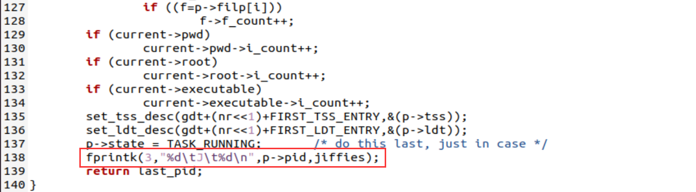
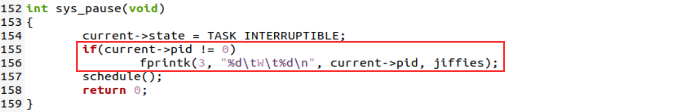
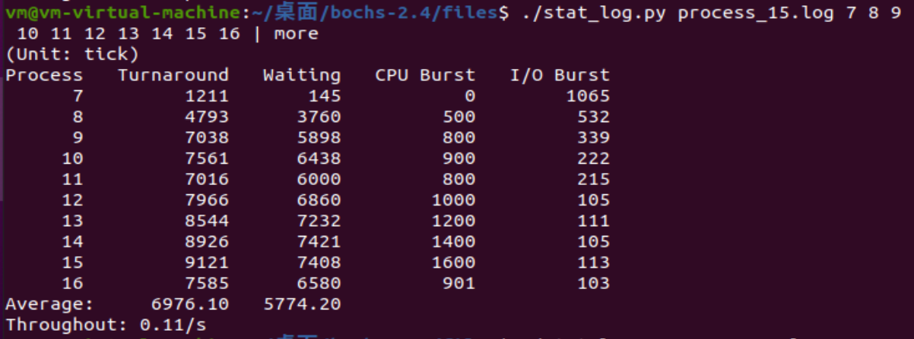

# 5. 进程运行轨迹的跟踪与统计

## 5.1. 实验目的

- 掌握 `Linux` 下的多进程编程技术；
- 通过对进程运行轨迹的跟踪来形象化进程的概念；
- 在进程运行轨迹跟踪的基础上进行相应的数据统计，从而能对进程调度算法进行实际的量化评价， 更进一步加深对调度和调度算法的理解，获得能在实际操作系统上对调度算法进行实验数据对比的直接经验。

## 5.2. 实验内容

进程从创建（ `Linux` 下调用 `fork()` ）到结束的整个过程就是进程的生命期， 进程在其生命期中的运行轨迹实际上就表现为进程状态的多次切换，如进程创建以后会成为就绪态； 当该进程被调度以后会切换到运行态；在运行的过程中如果启动了一个文件读写操作， 操作系统会将该进程切换到阻塞态（等待态）从而让出 `CPU` ； 当文件读写完毕以后，操作系统会在将其切换成就绪态，等待进程调度算法来调度该进程执行……

本次实验包括如下内容：

1. 基于模板 `process.c` 编写多进程的样本程序，实现如下功能：
   - 所有子进程都并行运行，每个子进程的实际运行时间一般不超过 `30` 秒；
   - 父进程向标准输出打印所有子进程的 `id` ，并在所有子进程都退出后才退出；
2. 在 `Linux 0.11` 上实现进程运行轨迹的跟踪。基本任务是在内核中维护一个日志文件 `/var/process.log` ，把从操作系统启动到系统关机过程中所有进程的运行轨迹都记录在这一 `log` 文件中。
3. 在修改过的 `0.11` 上运行样本程序，通过分析 `log` 文件，统计该程序建立的所有进程的等待时间、完成时间（周转时间）和运行时间，然后计算平均等待时间，平均完成时间和吞吐量。可以自己编写统计程序，也可以使用 `python` 脚本程序 `stat_log.py` 进行统计。
4. 修改 `0.11` 进程调度的时间片，然后再运行同样的样本程序，统计同样的时间数据，和原有的情况对比，体会不同时间片带来的差异。

`/var/process.log` 文件的格式必须为：

```
pid X time
```

其中：

- `pid` 是进程的 `ID` ；
- `X` 可以是 `N` , `J` , `R` , `W` 和 `E` 中的任意一个，分别表示进程新建( `N` )、进入就绪态( `J` )、进入运行态( `R` )、进入阻塞态( `W` )和退出( `E` )；
- `time` 表示 `X` 发生的时间。这个时间不是物理时间，而是系统的滴答时间( `tick` )；

## 5.3. 实验过程

1. 基于模板 `process.c` 编写多进程的样本程序， `process.c`需要改写的部分如下所示：

   ```c
   #define N	10
   int main(int argc, char * argv[])
   {
   	pid_t procs[N];
   	pid_t pid;
   	int i, status;
   	for(i=0; i<N; i++){
   		/*创建十个子进程*/
   		procs[i] = fork();
   		if(procs[i] == 0){
   			/*父进程向标准输出打印所有子进程id*/
   			printf("child%d is running, pid = %d\n", i, getpid());
   			cpuio_bound(N, i, 1);
   			exit(0);
   		}
   	}
   	while((pid = wait(&status)) > 0){
   		printf("child(pid=%d) terminated normally\n", pid);
   	}
   	return 0;
   }
   ```

   在这里我们创建了十个子进程，每个进程创建后父进程都会打印子进程的id，并在子进程结束时回收子进程打印提示信息，如下图所示。

   

2. 在 `Linux 0.11` 上实现进程运行轨迹的跟踪。基本任务是在内核中维护一个日志文件 `/var/process.log` ，把从操作系统启动到系统关机过程中所有进程的运行轨迹都记录在这一 `log` 文件中。

   首先为了记录日志信息，我们需要将文件描述符3和我们的日志文件也就是 `/var/process.log`相关联，为了从进程1的创建开始记录日志信息，这里我们对 `init/main.c` 的代码做了一点修改，如下图所示。

   

   在这里我们将本该在`init`函数中关联的文件描述符放到了`init`函数之前，就是为了能从进程1的创建开始记录日志信息。其中`O_CREAT|O_TRUNC|O_WRONLY`表示读写模式，`0666`表示文件描述符3对日志文件的访问权限为0666，也就是读写权限。

   接下来要考虑如何在内核模式写入文件，这里采用`fprintk`函数进行写入操作，如下所示：

   ```c
   #include <linux/sched.h>
   #include <sys/stat.h>
   
   static char logbuf[1024];
   int fprintk(int fd, const char *fmt, ...)
   {
       va_list args;
       int count;
       struct file * file;
       struct m_inode * inode;
   
       va_start(args, fmt);
       count=vsprintf(logbuf, fmt, args);
       va_end(args);
   
       if (fd < 3)    /* 如果输出到stdout或stderr，直接调用sys_write即可 */
       {
           __asm__("push %%fs\n\t"
               "push %%ds\n\t"
               "pop %%fs\n\t"
               "pushl %0\n\t"
               "pushl $logbuf\n\t" /* 注意对于Windows环境来说，是_logbuf,下同 */
               "pushl %1\n\t"
               "call sys_write\n\t" /* 注意对于Windows环境来说，是_sys_write,下同 */
               "addl $8,%%esp\n\t"
               "popl %0\n\t"
               "pop %%fs"
               ::"r" (count),"r" (fd):"ax","cx","dx");
       }
       else    /* 假定>=3的描述符都与文件关联。事实上，还存在很多其它情况，这里并没有考虑。*/
       {
           // if (!(file=task[0]->filp[fd]))    /* 从进程0的文件描述符表中得到文件句柄 */
           //    return 0;
           
           // 修改为如下：
           // task[1]->filp is not ready or f_inode->i_dev is not ready
           if (!(file=task[1]->filp[fd]) || !task[1]->filp[fd]->f_inode->i_dev) {   /* 从进程1的文件描述符表中得到文件句柄 */
               return 0;
           }
           inode=file->f_inode;
   
           __asm__("push %%fs\n\t"
               "push %%ds\n\t"
               "pop %%fs\n\t"
               "pushl %0\n\t"
               "pushl $logbuf\n\t"
               "pushl %1\n\t"
               "pushl %2\n\t"
               "call file_write\n\t"
               "addl $12,%%esp\n\t"
               "popl %0\n\t"
               "pop %%fs"
               ::"r" (count),"r" (file),"r" (inode):"ax","cx","dx");
       }
       return count;
   }
   ```

   最后我们需要寻找状态切换的地方，在状态切换时进行日志记录 ，也就是在状态切换的地方加上`fprintk`函数。

   1. `fork.c`中的`copy_process`函数：

      

      

   2. `sched.c`中的`schedule`函数：

      

   3. `sched.c`中的`sys_pause`函数：

      

   4. `sched.c`中的`sleep_on`函数：

      

   5. `sched.c`中的`interruptible_sleep_on`函数：

      

   6. `sched.c`中的`wake_up`函数：

      

   7. `exit.c`中的`do_exit`函数：

      

   8. `exit.c`中的`sys_waitpid`函数：

      

   

3. 在修改过的 `0.11` 上运行样本程序，通过分析 `log` 文件，统计该程序建立的所有进程的等待时间、完成时间（周转时间）和运行时间，然后计算平均等待时间，平均完成时间和吞吐量。可以自己编写统计程序，也可以使用 `python` 脚本程序 `stat_log.py` 进行统计。

   运行`./stat_log.py process.log 7 8 9 10 11 12 13 14 15 16`指令可得到如下结果：

   

4. 修改 `0.11` 进程调度的时间片，然后再运行同样的样本程序，统计同样的时间数据，和原有的情况对比，体会不同时间片带来的差异。

   由 `0.11`的`sched.c`中的`schedule`函数中的调度算法可知，我们只要修改`sched.h`中的priority就行，如下图所示：

   

   得到的结果如下图所示。

   

   可以发现平均等待时间以及平均完成时间随着时间片的切片数增多而减少 。

## 5.4. 实验报告

完成实验后，在实验报告中回答如下问题：

1. 结合自己的体会，谈谈从程序设计者的角度看，单进程编程和多进程编程最大的区别是什么？

   单进程编程所编写的程序是顺序执行的，只需要保证这一个进程上下文逻辑通顺，且数据是同步的，但单进程编程对于cpu的利用率较低，比如说碰到IO操作的时候就会阻塞进程；

   多进程编程所写的程序是同时执行的，也就是说多进程需要并发执行，执行顺序是随机的，无法确定，所以程序员要做好进程之间的同步、通信和互斥，以便避免遇到死锁和饥饿等问题，因此多进程编程要更加复杂，同时用途也要更加广泛。

2. 你是如何修改时间片的？仅针对样本程序建立的进程，在修改时间片前后， `log` 文件的统计结果（不包括Graphic）都是什么样？结合你的修改分析一下为什么会这样变化，或者为什么没变化？

   我在`include/linux/sched.h`中修改`#define INIT_TASK`宏定义中的priority的值，就可以起到修改时间片的结果。

   一共修改了三次时间片的值，分别是1，5，10，结果如下：

   时间片为1：

   

   时间片为5：

   

   时间片为10：

   

   可以发现如下变化：

   1. 在时间片比较小的时候，平均等待时间，平均完成时间的变化随着时间片的增大而减小。这是因为在时间片小的时候，cpu在调度上花费了更多时间；
   2. 然而随着时间片增大，等待时间和周转时间也随之增加，这是因为进程因中断或者睡眠进入的进程调度次数也增多，等待时间随之变长。

   所以需要设置合理的时间片，在这里最优的时间片大致为5左右。