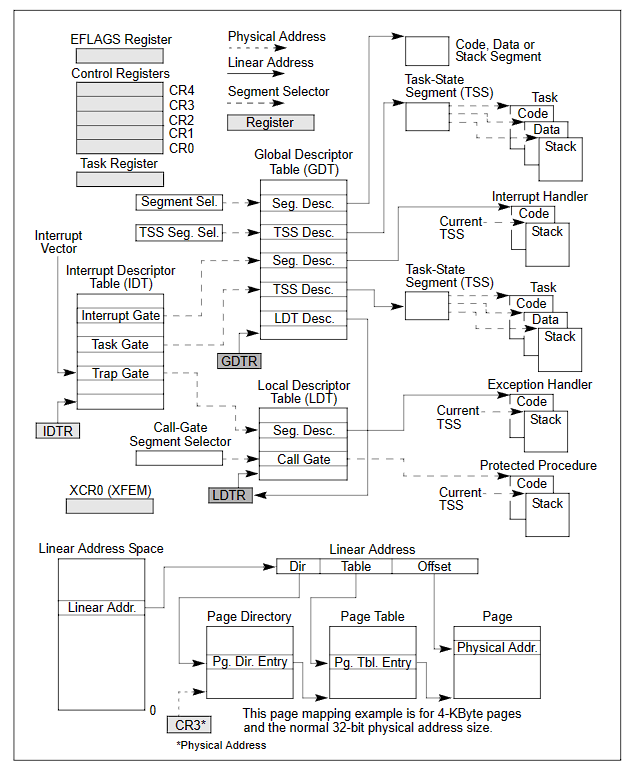
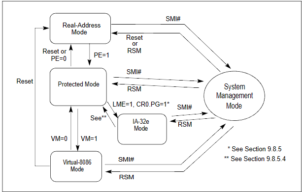
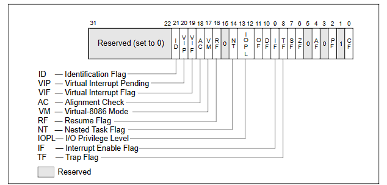
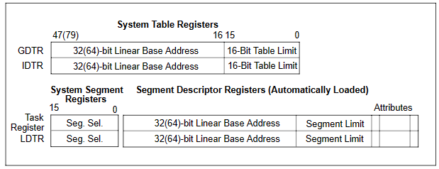
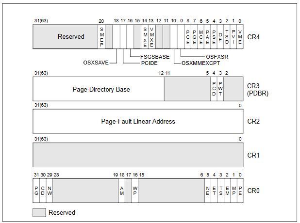

[toc]
# 1. x86系统架构概览
## 1.1. 系统级体系结构概览
IA-32 系统级架构由一组寄存器、数据结构和指令组成，旨在支持基本的系统级操作，如内存管理、中断和异常处理、任务管理和多个处理器的控制。

IA-32系统级寄存器与数据结构如下图所示。

### 1.1.1. 全局和局部描述符表(Global and Local Descriptor Tables)

在保护模式下操作时，所有内存访问都通过全局描述符表（GDT）或可选的本地描述符表（LDT）。这些表包含称为段描述符的条目。在这些描述符表里是端描述符，段描述符里包含了段的基址以及访问权限、类型和使用信息。每个段描述符都有一个关联的段选择符。段选择符包含了 GDT 或 LDT(与它相关的段描述符)里的一个索引、一个全局/局部标志(决定段选择符是指向 GDT 还是指向 LDT)和访问特权等信息。

要访问段中的内容，必须同时提供段选择符和偏移地址，为段(在 GDT 或者 LDT 中)的描述符提供了一个访问途径。对于段描述符，处理器包含了线性地址空间里的基地址，偏移量确定了相对于基地址的字节地址。如果在处理器运行的当前特权级(CPL-Current Privilege Level)上可以访问段的话(CPL 被定义为当前执行代码段的保护级)，那么就可以通过这种机制来访问在 GDT 或 LDT中的各种合法代码、数据或者堆栈段。

为了便于描述，许多段选择符被简化成直接指向段。然而实际上从段选择符到相应的段都是通过 GDT 或者 LDT。GDT 的线性地址是在 GDT 寄存器中(GDTR)，LDT 线性地址是在 LDT 寄存器中(LDTR)。

GDTR（Global Descriptor Table Register）和LDTR（Local Descriptor Table Register）寄存器在IA-32e的两种子模式（64位模式和兼容模式）中都扩展为64位宽度。在64位模式下，全局描述符表和本地描述符表被扩展以支持64位的基地址（16字节的LDT描述符包含一个64位的基地址和各种属性）。在兼容模式下，描述符不会被扩展。

### 1.1.2. 系统段、段描述符和门(System Segments, Segment Descriptors, and Gates)

除了代码、数据和堆栈段是构成程序运行环境之外，系统架构还定义了两个系统段:任务状态段(TSS)和LDT。(GDT不被看作段因为它不能通过段选择符和段描述符访问)。这些段类型都有一个专门为它们定义的描述符。

系统架构也定义了一套称为门的描述符(调用门、中断门、陷阱门和任务门)，这些门提供了一种访问运行在不同于应用程序特权级的系统过程和处理程序的方法。例如一个对调用门的调用可以访问与当前代码段特权相同或者数字更低(特权更高)的代码段中的过程。通过调用门访问，调用程序必须提供调用门的选择符。执行访问特权检查的处理器比较调用门的特权和调用门指向的目的代码的 CPL。如果允许访问，处理器从调用门得到目标代码段的选择符和偏移地址。如果调用需要进行特权级的改变，，处理器也切换到那个级别的堆栈(新堆栈的段选择符是通过当前运行任务的 TSS 获得的)。调用门也使得 16 位和 32 位之间的转换变得更加容易，反之亦然。

在IA-32e模式下，以下描述符是16字节描述符（扩展以允许64位基址）：LDT描述符、64位TSS（任务状态段）、调用门、中断门和陷阱门。调用门（Call gates）方便在64位模式和兼容模式之间进行过渡。在IA-32e模式下不支持任务门（Task gates）。在特权级别发生变化时，不会从TSS中读取堆栈段选择符。相反，它们将被设置为NULL。

### 1.1.3. 任务状态段和任务门(Task-State Segments and Task Gates)

TSS定义了任务执行环境的状态。这些状态包括通用寄存器、段寄存器、EFLAGS寄存器、EIP 寄存器和段选择符以及三个堆栈段(特权 0、1、2 各一个堆栈)的指针的状态它也包括了与任务相应的 LDT 的选择符和页表的基地址。

所有运行在保护模式下的程序，都是在一个被称作是当前任务的上下文中进行的。当前任务的 TSS的段选择符保存在任务寄存器中。切换到一个任务的最简单的方法是进行 CALL 或JMP 到那个任务中。新任务的 TSS 的段选择符是通过 CALL 或JMP 指给出。在进行任务切换时，处理器按照下面的次序进行:

1. 将当前任务的状态存储在当前 TSS 中。
2. 装载新任务段选择符的任务寄存器。
3. 通过 GDT 中的段描述符访问新的 TSS。
4. 将新 TSS 中新任务的状态装载到通用寄存器、段寄存器、LDTR、控制寄存器 CR3(页表基地址)、EFLAGS 寄存器和 EIP 寄存器。
5. 开始执行新任务。

也可以通过任务门访问任务。任务门与调用门很相似，但是任务门提供了对TSS 的访问，而不是对代码段的访问。

但是IA-32e模式不支持硬件任务切换（Hardware task switches）。然而，TSSs（任务状态段）仍然存在。一个TSS的基地址由其描述符指定。

一个64位TSS包含了对64位操作非常重要的信息：

- 每个特权级别的堆栈指针地址
- 中断堆栈表的指针地址
- IO权限位图的偏移地址（相对于TSS基址）

同时，在IA-32e模式下，任务寄存器被扩展以容纳64位基地址。

### 1.1.4. 中断和异常处理(Interrupt and Exception Handling)

外部中断、软件中断和异常是通过中断描述符表（IDT）处理。IDT包含了访问中断和异常处理程序的门描述表的集合。像GDT一样，IDT不是一个段，IDT的线性基地址包含在IDT寄存器中(IDTR)。IDT中的门描述符包括中断、陷阱或者任务门类型。在运行中断或异常处理程序时，处理器必须先从内部硬件、外部中断控制器或通过执行INT，INTO，INT 3或BOUND指令的软件中断中接到一个中断向量。中断向量包含了IDT中门描述符的索引。如果选中的门描述符是一个中断门或者陷阱门，相应的处理程序通过调用门来调用过程。如果描述符是一个任务门，处理程序是通过任务切换来进行的。

在 IA-32e 模式下，中断描述符扩展到 16 字节以支持 64 位基址。对于 64 位模式和兼容模式也是如此。IDTR 寄存器也被扩展以容纳64位基址。不支持任务门（Task gates）。

### 1.1.5. 内存管理(Memory Management)

系统架构支持直接物理地址内存或者虚拟内存(通过分页) 。当用直接物理地址时，线性地址就是物理地址，当使用分页时，所有代码、堆栈、系统段、GDT、IDT都可以将最近访问过的页保留在内存中而进行分页。页(在IA-32架构有时被称作页框）在物理内存中的位置保存在两个类型的系统数据结构中(页目录和页表)，这两个数据结构都保存物理内存中。页目录包含有页表的物理地址、访问特权、内存管理信息，页表中包含有页框的物理地址、访问特权和内存管理信息。页目录的基地址保存在控制寄存器CR3中。为使用分页机制，一个线性地址被分为三个部分:页目录、页表和页框中的偏移量。一个系统可以有一个或者多个页目录，比如每个任务都可以有自己的页目录。

在IA-32e模式下，物理内存页面由一组系统数据结构管理。在兼容模式和64位模式下，使用了四级系统数据结构。其中包括：

- 页映射级别4（PML4）：PML4表中的一个条目包含页目录指针表基地址的物理地址、访问权限以及内存管理信息。PML4的基本物理地址存储在CR3寄存器中。
- 一组页目录指针表：页目录指针表中的一个条目包含页目录表基地址的物理地址、访问权限以及内存管理信息。
- 一组页目录表：页目录表中的一个条目包含页表基地址的物理地址、访问权限以及内存管理信息。
- 一组页表：页表中的一个条目包含页面帧的物理地址、访问权限以及内存管理信息。

### 1.1.6. 系统寄存器(System Registers)

为了更好地初始化处理器及控制系统的运行,架构在EFLAGS寄存器内提供了系统标志和几个系统寄存器:

- EFLAGS寄存器内的系统标志和IOPL域，控制着任务和模式切换、中断处理、指令跟踪和访问特权。
- 控制寄存器（CR0、CR2、CR3和CR4）包含各种标志和数据字段，用于控制系统级操作。这些寄存器中的其他标志用于指示对操作系统或执行程序中特定处理器功能的支持。
- 调试寄存器允许设置断点，用于调试程序和系统软件。
- GDTR、LDTR和IDTR寄存器包含其各自表格的线性地址和大小。
- 任务寄存器包含当前任务的TSS的线性地址和大小。
- 特定于模型的寄存器。

模式相关寄存器(MSRs)是一组主要用于操作系统的寄存器(也就是代码运行在0级特权下)。这些寄存器控制着如调试扩展、性能监测计数器、机器检测架构和内存类型范围 (MTRRs)这些寄存器的个数和功能，在IA-32架构系列的处理器中的各处理器各有不同。

大多数的系统都限制应用程序访问所有的系统寄存器(而不是 EFLAGS 寄存器)。然而系统也可以设计成所有程序均运行在最高特权 0 级)上，在这种情况下应用程序可以修改所有系统寄存器。

在IA-32e模式下，四个系统描述符表寄存器（GDTR、IDTR、LDTR和TR）在硬件中扩展为64位基地址。EFLAGS成为64位的RFLAGS寄存器。CR0-CR4扩展到64位。CR8也变得可用。CR8提供对任务优先级寄存器（TPR）的读写访问，以便操作系统可以控制外部中断的优先级类别。

在64位模式下，调试寄存器DR0-DR7是64位的。在兼容模式下，DR0-DR3中的地址匹配也以64位粒度进行。

在支持 IA-32e 模式的系统上，扩展功能启用寄存器 （IA32_EFER） 可用。此型号特定的寄存器控制 IA-32e 模式和其他 IA-32e 模式操作的激活。此外，还有几个特定于型号的寄存器用于控制 IA-32e 模式指令：
- IA32_KernelGSbase — 由SWAPGS指令使用。
- IA32_LSTAR — 由SYSCALL指令使用。
- IA32_SYSCALL_FLAG_MASK — 由SYSCALL指令使用。
- IA32_STAR_CS — 由SYSCALL和SYSRET指令使用。

## 1.2. 实模式和保护模式转换
IA-32支持三种操作模式和一种准操作模式：

- 保护模式 — 这是处理器的原生模式。它提供了丰富的体系结构特性、灵活性、高性能和对现有软件基础的向后兼容性。
- 实模式 — 此操作模式提供了Intel 8086处理器的编程环境，带有一些扩展功能（例如切换到保护模式或系统管理模式的能力）。
- 系统管理模式（SMM）— 系统管理模式是所有IA-32体系的标准架构特征，它首先在intel 386SL处理器中出现。这种模式为操作系统实现电源和OEM专有特征提供的一种透明的机制。SMM模式是通过激活外部系统中断针 (SMI#) 而进入的，激活产生了一个系统中断(SMI) 。在SMM中处理器先保存好当前运行的程序和任务的上下文然后切换到一个单独的地址空间，从SMM返回后处理器再返回SMI之前的状态。
- 虚拟8086模式 — 在保护模式下，处理器支持一种称为虚拟8086模式的准操作模式。这种模式
  允许在多任务的保护模式下处理执行 8086 程序。
- IA-32e模式 — 在IA-32e模式下，处理器支持两种子模式：兼容模式和64位模式。64位模式提供64位线性寻址和支持大于64 GB的物理地址空间。兼容模式允许大多数传统的受保护模式应用程序保持不变。

下图展示了处理器在各种操作模式之间的切换过程。

处理器在上电或复位后置于实址模式。然后，控制寄存器 CR0 中的 PE 标志控制处理器是在实地址模式下或者在保护模式下运行。

EFLAGS 寄存器中的 VM 标志确定处理器是在保护模式还是虚拟 8086 模式下运行。保护模式和虚拟8086 模式之间的转换通常作为任务切换的一部分或中断或异常处理程序的返回的一部分进行。

LMA 位（IA32_EFER.LMA[bit 10]）确定处理器是否在 IA-32e 模式下运行。在 IA-32e 模式下运行时，64位或兼容子模式操作由代码段的CS.L位决定。处理器从保护模式切换到IA-32e模式时，需要启用分页并设置LME位（IA32_EFER.LME[bit 8]）。

当处理器处于实模式、保护模式、虚拟 8086 模式或 IA-32e 模式时，只要接收到SMI（System Management Interrupt，系统管理中断），处理器就会切换到SMM（System Management Mode，系统管理模式）。执行RSM指令后，处理器总是返回到SMI发生时的模式。

## 1.3. 80x86系统指令寄存器
### 1.3.1 标志寄存器 EFLAGS
系统标志和EFLAGS寄存器的IOPL域用于控制I/O、可屏蔽硬件中断、调试、任务切换和虚拟8086模式。只有特权代码(通常是操作系统代码)可以修改这些位。

EFLAGS寄存器中的系统标志如下图所示：

系统标志和IOPL字段为：

- TF：陷阱（第8位）置1是调试状态下的单步执行，置0是禁用单步执行。在单步执行模式下处理器在每条指令后产生一个调试异常,这样在每条指令执行后都可以查看执行程序的状态。如果程序用POPF、POPFD或者IRET指令修改TF标志，那么调试异常就在执行POPF、POPFD或者IRET指令后产生。
- IF：中断允许（第9位）控制着处理器对可屏蔽硬件中断请求的响应。置1是响应可屏蔽硬件中断，置0为禁止响应可屏蔽硬件中断，IF标志并不影响异常和不可屏蔽中断(NMI) 的产生。控制寄存器CR4中的CPL、IOPL和VME标志决定着IF标志是可否可以由指令CLI、STTI、POPF、POPFD和IRET修改。
- IOPL：I/O特权域（第12、13位），指出当前程序或任务的I/0特权级别。当前程序或任务的CPL必须小于或等于IOPL才可以访问I/0地址空间。当运行在0级特权时，该域只能由的POPF和IRET指令修改。当虚拟模式扩展起作用时(控制寄存器CR4中的VME置位时)，IOPL也是控制IF标志的修改以及控制虚拟8086模式下中断的处理方式的机制之一。
- NT：嵌套任务（第14位）控制被中断和被调用的任务的链接。处理器在调用一个由CALL指令、中断或者异常触发的任务时设置该位。当任务因调用IRET指令而返回时，处理器检测并修改该位。该标志可以由POPF/POPFD指令直接置位或清零，然而在应用程序中修改该标志的状态会产生不可预料的异常。
- RF：恢复（第16位）控制着处理器对断点指令条件的响应。当置1时，该标志可以临时禁用由于指令断点而产生调试异常 ( #DE) ，但是其它的异常条件仍可以产生异常置0时指令断点产生调试异常。
- VM：虚拟8086模式（第17位）置1进入虚拟8086模式，置0返保护模式。
- AC：对齐检查（第18位），将该位置1的同时，将控制寄存器中CRO中的AM标志置1就启用了对内存引用的对齐检查。将AC标志和/或AM标志清零就禁用了对文检查。当引用一个没有对齐的操作数时，将会产生一个对齐检查的异常，比如在奇地址引用一个字地址或在不是4的倍数的地址引用一个双字地址。对文检查异常只在用户模式(3级特权)下产生。默认特权为0的内存引用，比如段描述表的装载，并不产生这个异常，虽然它在用户模式会产生。对齐检查异常可以用于检查数据的对齐，这对于当和其它处理器交换数据时是有用的，交换数据需要所有数据对文。对文检查异常也可以被解释程序用来将某些指针标记不对齐从而成为特殊指针,这样就减轻了对每个指针进行对齐检查的负担，只要对使用的特殊指针进行就可以了。
- VIF：虚拟中断（第19位）包含了一个 IF 标志的虚拟映象。这个标志是和 VIP 标志一起使用的。当控制寄存器 CR4 中的 VME 或者 PVI 标志置为 1且 IOPL 小于3 时，处理器只识别 VIF 标志。
- VIP：虚拟中断等待（第20位）由软件置1以指示中断挂起；清零表示没有中断挂起。该标志与VIF标志结合使用。处理器读取此标志但从不修改它。当且仅当控制寄存器CR4中的VME标志或PVI标志被置1且IOPL小于3时，处理器识别VIP标志。
- ID：标识位（第21位），如果程序或过程具有设置或清除此标志的能力，那么该程序或过程支持CPUID指令。

### 1.3.2 内存管理寄存器

该处理器提供四个内存管理寄存器（GDTR、LDTR、IDTR 和 TR），用于指定控制分段内存管理的数据结构的位置。

内存管理寄存器如下图所示：

1. 全局描述符表寄存器 (GDTR)
   
    GDTR寄存器保存了GDT的32位基地址和16位表界限。基地址是指GDT的0字节的线性地址，表界限是指表中的字节个数。LGDT和SGDT指令是用来分别装载和保存GDTR寄存器的。处理器上电或复位，基地址就被设为缺省的0，表界限设为FFFFH。对于保护模式的操作，作为处理器初使化过程的一部分，一个新的基地址必须装入GDTR。
    
2. 本地描述符表寄存器(LDTR)
   
    GDTR寄存器保存了GDT的32位基地址和16位表界限。基地址是指GDT的0字节的线性地址，表界限是指表中的字节个数。LGDT和SGDT指令是用来分别装载和保存GDTR寄存器的。处理器上电或复位，基地址就被设为缺省的0，表界限设为FFFFH。对于保护模式的操作，作为处理器初使化过程的一部分，一个新的基地址必须装入GDTR。

3. 中断描述符表寄存器(IDTR)
   
   IDTR寄存器包含IDT（中断描述符表）的基地址（在保护模式下为32位；在IA-32e模式下为64位）和16位的表限制。基地址指定了IDT的第0字节的线性地址，而表界限则指定了表中的字节数。LIDT和SIDT指令分别用于加载和存储IDTR寄存器的值。在处理器上电或复位时，基地址被设置为默认值0，而界限被设置为0FFFFH。然后，寄存器中的基地址和限制可以在处理器初始化过程中进行更改。

4. 任务寄存器(TR)
   
    任务寄存器保存着16位的段选择符,32位基地址,16位段界限和当前任务的TSS描述符属性。它引用GDT中的TSS描述符。基地址指明TSS中的0字节的线性地址，段界限指明TSS中的字节个数。 LTR 和 STR 指令是分别用来装载和保存任务寄存器段选择符部分的。当用 LTR 装载一个任务寄存器中的段选择符时，基地址、界限和 TSS 描述符都被自动的装载到任务寄存器处理器上电或复位后，基地址设成默认的 0，界限被设成 0FFFFH。进行任务切换时，任务寄存器就自动装载新任务的段选择符和 TSS 描述符。在往任务寄存器写入新的内容时，任务寄存器并不会自动保存。

### 1.3.3 控制寄存器
控制寄存器 (CRO、CR1、CR2、CR3) 决定了处理器的运行模式和当前正在执行的任务的特征。

控制寄存器如下图所示：

下面总结了控制寄存器，并单独描述了这些控制寄存器中每个架构定义的控制字段。

- CR0 — 包含系统控制标志，这些标志控制着处理器的运行模式和状态。
- CR1 — 保留。
- CR2 — 包含缺页的线性地址(引起缺页的线性地址)。
- CR3 — 包含了页目录的基地址和二个标志 (PCD和PWT)。该寄存器也被称为页目录基地址寄存器(PDBR)。页目录基地址只有高20位确定，低12位是0，所以页目录地址必须是页边界对文的(4K字节)。PCD和PWT标志控制着页目录在处理器内部数据缓冲区的缓存。当使用物理地址扩展时，CR3寄存器包含了页目录指针表的基地址。

**PG(Paging (bit 31 of CR0))：**分页标志位（CR0中的第31位），设置该位启用分页。复位不启动分页。不启用分页时，线性地址就等同于物理地址。如果没有设置PE位（CR0中的第0位），设置该标志位也不会启用分页。若没有设PE位，而尝试设置PG位会导致一般保护异常（#GP）。

**CD(Cache Disable (bit 30 of CR0))：**当复位CD和NW标志位时，会启用了处理器内部(和外部)缓存中整个物理内存的缓存。当设置了CD标志时，缓存则不启用。 为了防止处理器访问和更新它的缓存，必须设置CD标志并使缓存失效，这样就不会发生缓存命中。

**NW（Not Write-through (bit 29 of CR0))：**当复位NW和CD标志位时，启用写回策略（写入缓存）（适用于Pentium 4、Intel Xeon、P6系列和Pentium处理器）或写直达策略（直接写内存）(适用于Intel486处理器)，来实现命中缓存的写操作，并启用失效周期。

**AM（Alignment Mask (bit 18 of CR0))：**设置该标志位时，可进行自动对齐检查；复位时禁用对齐检查。当且仅当设置AM、EFLAGS寄存器中的AC，且CPL为3，并且处理器在保护模式或虚拟8086模式下运行时，才会执行对齐检查。

**WP（Write Protect (bit 16 of CR0))：**写保护位（CR0的第16位），设置该标志位时，禁止管理员级程序写入只读页面; 复位时，允许管理员级程序写入只读页面（无论U/S位设置）。 这个标志有助于实现写时复制方法，还可用于创建UNIX等操作系统使用的新进程（fork）。

**NE(Numeric Error (bit 5 of CR0))：**设置该标志位启用本机（内部）机制报告x87 FPU错误。并且输入IGNNE#，忽略x87 FPU错误。 复位时，没有输入IGNNE#，一个未被屏蔽的x87 FPU错误会导致处理器在FERR#引脚产生一个外部中断，并在执行下一个等待浮点指令或WAIT/FWAIT指令之前立即停止指令的执行。

**ET（Extension Type (bit 4 of CR0))：**扩展类型位（CR0的第4位），Pentium 4、Intel Xeon、P6系列和Pentium处理器中使用。 在Pentium 4、Intel Xeon和P6系列处理器中，该标志被硬编码为1。 在Intel386和Intel486处理器中，设置该标志表示支持intel387 DX数学协处理器指令。

**TS (Task Switched (bit 3 of CR0))：**任务切换标志位（CR0的第3位），允许切换任务的x87 FPU、MMX、SSE、SSE2、SSE3、SSSE3、SSE4上下文的延迟保存，直到新任务执行一个x87 FPU、MMX、SSE、SSE2、SSE3、SSSE3、SSE4指令。 处理器在每个任务开关上设置这个标志，并在执行x87 FPU、MMX、SSE、SSE2、SSE3、SSSE3、SSE4指令时测试它。如果设置了TS并且复位了EM(CR0的第2位)，在执行任何x87 FPU、MMX、SSE、SSE2、SSE3、SSSE3、SSE4指令之前会引发设备不可用异常(#NM)；而PAUSE、PREFETCHh、SFENCE、LFENCE、MFENCE、MOVNTI、CLFLUSH、CRC32和POPCNT指令除外。如果设置TS，复位MP标志(CR0的第1位)和EM标志，在执行x87 FPU WAIT/FWAIT指令之前，不会引发#NM异常。 如果设置了EM标志，TS标志的设置对x87 FPU、MMX、SSE、SSE2、SSE3、SSSE3、SSE4指令的执行没有影响。

**EM(Emulation (bit 2 of CR0))：**仿真位（CR0的第2位），设置该标志位时表示处理器没有内部或外部x87 FPU;；复位时表示系统又协处理器。 这个标志位也影响FPU、MMX、SSE、SSE2、SSE3、SSSE3、SSE4指令的执行

**MP(Monitor Coprocessor (bit 1 of CR0))：**监控协处理器标志位（CR0的第1位），控制WAIT(或FWAIT)指令与TS标志（CR0的第3位）的交互作用。 若设置了MP标志位TS标志位，则WAIT指令会产生一个设备不可用异常(#NM)。 如果复位MP标志，则WAIT指令忽略TS标志的设置。

**PE(Protection Enable (bit 0 of CR0))：**保护启用标志位（CR0的第0位），设置该标志位时启用保护模式; 复位时启用实地址模式。 设置该标志位不会直接启用分页。 它只启用段级保护。 若要启用分页功能，必须同时设置PE和PG标志。

**PCD(Page-level Cache Disable (bit 4 of CR3))：**页级缓存禁用(CR3的第4位)，控制访问页目表的第一个页表的内存类型。如果禁用分页，将不使用PAE分页；若CR4.PCIDE = 1，则使用IA-32e分页。

**PWT(Page-level Write-Through (bit 3 of CR3))：**页级透写（CR3的第3位），控制访问的当前页目表中第一个页表的内存类型。 如果禁用分页，将不使用PAE分页；若CR4.PCIDE = 1，则使用IA-32e分页。

## 1.4. 系统指令

|指令|指令描述|说明|对应用程序是否有用|应用程序能否执行|
|---|---|---|---|---|
|LGDT|装载GDT寄存器|把GDT基地址和界限从内存中装载到GDTR寄存器中|否|是|
|SGDT|保存GDT寄存器|把GDTR寄存器中的GDT基地址和界限保存到内存中|否|否|
|LIDT|装载IDT寄存器|把IDT基地址和界限从内存装载到IDTR寄存器中|否|是|
|SIDT|保存IDT寄存器|把IDTR寄存器的IDT基地址和界限保存到内存中|否|否|
|LLDT|装载LDT寄存器|从内存中装载LDT段选择符和段描述符到LDTR寄存器中|否|是|
|SLDT|保存LDT寄存器|把LDTR寄存器中的LDT段选择符保存内存中或者通用寄存器中|否|否|
|LTR|装载任务寄存器|把TSS的段选择符和段描述符从内存中装载到任务寄存器中|否|是|
|STR|保存任务寄存器|把当前任务的任务寄存器中的段选择符保存到内存或者通用寄存器中|否|否|

