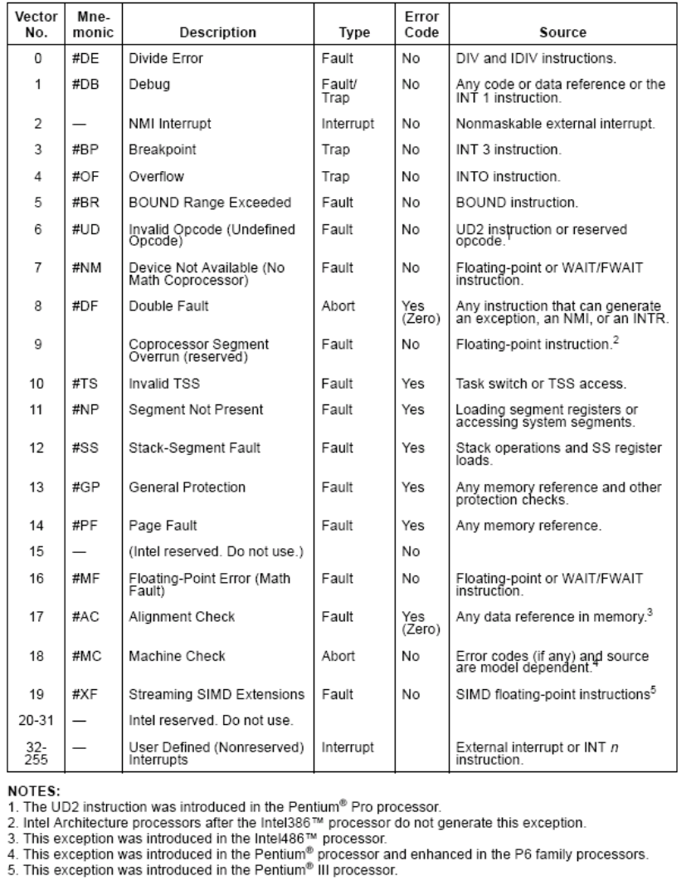
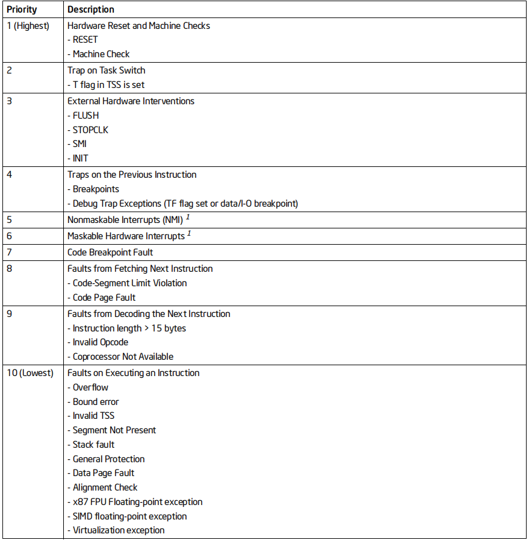
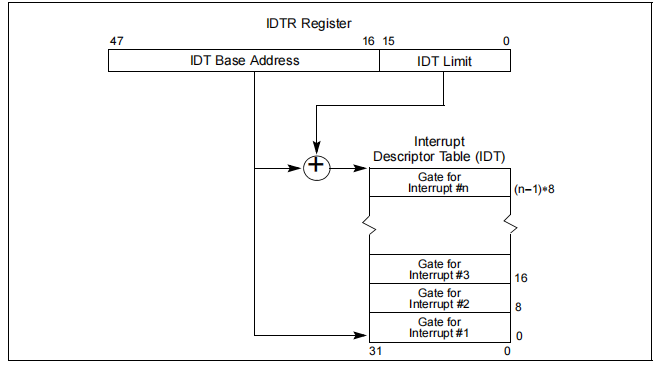
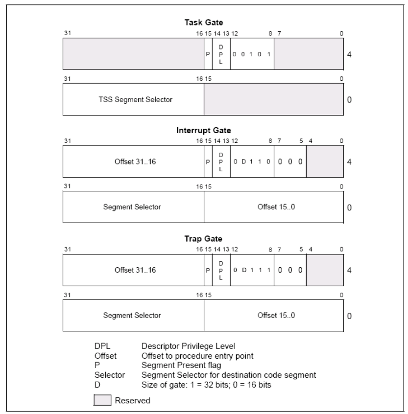
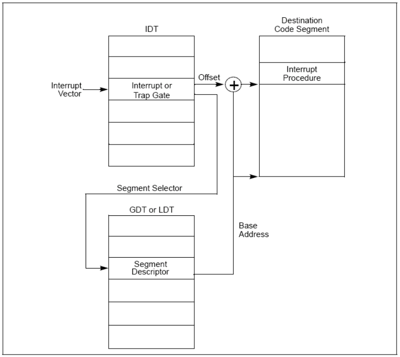
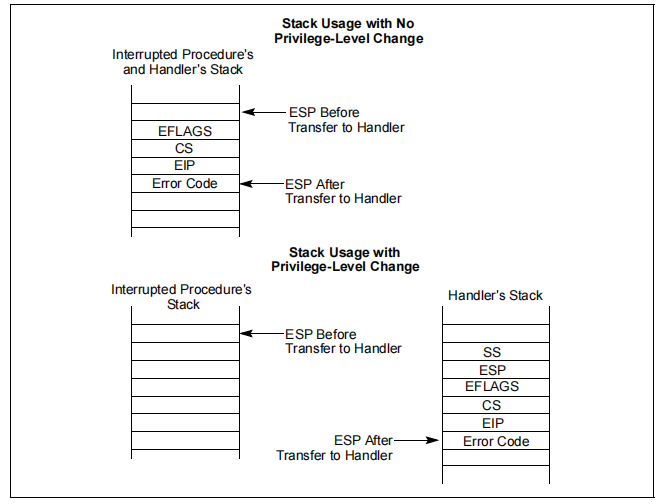
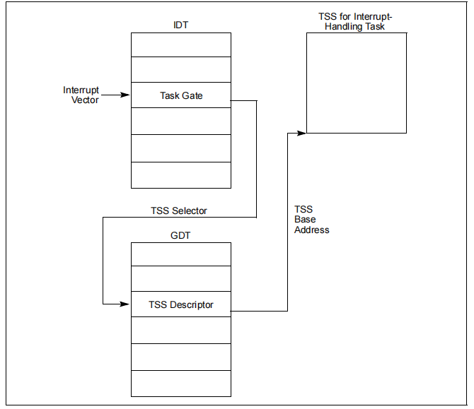

[toc]

# 3. 中断和异常处理

## 3.1. 中断和异常处理概述

中断和异常是强制性的执行流的转移，从当前正在执行的程序或任务转移到一个特殊的称作句柄的例程或任务。当硬件发出信号时，便产生中断，中断的产生同正在执行的程序是异步的，即中断的产生是随机的。其用于处理处理器的外部事件，比如为外设服务的请求使用 INT  n 指令，软件也可以产生中断。异常是在处理器执行指令的过程中发现错误而产生的，比如除数为零。处理器可以检测出多种不同的错误，包括保护异常，页错误，内部机器错误。P6 家族和 Pentium 处理器还允许当出现硬件错误和总线错误时产生硬件检测异常。

处理器的中断和异常处理机制使中断和异常的处理对于应用程序和操作系统或可执行程序来说是透明的。当处理器收到中断信号或检测到异常时，便挂起当前正在运行的进程或任务，而转去执行中断或异常处理例程。中断或异常处理例程执行完之后，处理器继续被中断的进程或任务。被中断的进程或任务继续执行，就像从未被打断过一样，只有两种情况例外:无法从发生的异常恢复，中断使当前的程序终止。

## 3.2. 有关中断和异常了解性的内容

### 3.2.1. 中断和异常向量

处理器为每个异常和中断分配了一个识别码，称作向量。下表列出了异常和中断向量的分配情况，该表还提供了每个向量的异常类型，某个异常是否含有出错码，并给出了异常和中断源。
向量号从 0到 31 被分配给异常和 NMI 中断使用。但目前的处理器还未使用完全部的这 32个向量。未使用的向量号保留给将来使用。不要将其移做它用。

32 到 255之间的向量号提供给用户使用。这些中断不在 Intel 的保留部分之列，一般被分配给外部 I/0 设备，允许它们通过某个外部硬件中断机制 向处理器传递信号。



### 3.2.2. 中断源和异常源

### 3.2.2.1.  中断源

1. 外部中断

   外部中断是通过处理器的引脚接收的，也可以通过局部 APIC 串行总线接收。P6 家族或Pentium 处理器上主要的中断引脚是连接到局部APIC 的 LINT[1: 0]两个引脚,当局部 APIC 被关闭时，这两个引脚被分别配置成 INTR 和 NMI 引脚。当信号由 INTR 引脚传递给处理器时,便发生了一个外部中断,处理器从系统总线读取由外部中断控制器(如 8259A) 发来的中断向量号。若信号从 MMI 引脚传递进来，则发生的是一个不可屏蔽中断(NMI)，其向量号为 2。

   当 APIC 打开时，可通过 APIC 向量表对 LINT[1:0]引脚编程，使其和处理器的任意异常和中断向量绑定。

   处理器局部 APIC 能够和系统上的 I/O APIC 相连。由I/O APIC 引脚接收到的外部中断能通过APIC 串行总线(PICD[1: 0]引脚) 传达到局部 APIC。I/0 APIC 决定中断向量号并将其送往局部 APIC。当一个系统拥有多个处理器时，处理器之间也可通过 APIC 串行总线相互传递中断信号。

   Intel486 和早期的 Pentium 处理器不具有芯片内建的局部 APIC，因而也没有 LINT[1:0]引脚。这些处理器却有专用的 NMI 和 INTR 引脚。对于这些处理器，外中断由系统板上的中断控制器(8259A) 产生，这些信号由 INTR 引脚传递给处理器。

2. 可屏蔽硬件中断

   任何通过 INTR 引脚或局部 APIC 传递到处理器的外部中断都被称作可屏蔽硬件中断。通过INTR 引脚传递的可屏蔽硬件中断可使用所有 Intel 架构定义的中断向量(0~255): 而通过局部 APIC 传递的部分只能使用 16~255 号向量。使用 EFLAGS 寄存器的 IF 位就可以屏蔽全部可屏蔽硬件中断。注意当 0 号中断到 15 号中断通过局部 APIC 传递时，APIC 会指出错误的向量。

3. 软件产生的中断

   将中断向量号作为 INT 指今的操作数即可通过 INT 指令在程序中产生中断。比如，指令 INT 35 即可调用第 35 号中断处理例程。

   0 到 255 号中断均可使用 INT 指令调用。但是，当处理器预先定义好的 NMI 中断被这样调用时,处理器作出的响应与真正 NMI 中断发生时的响应并不一样。也就是说,执行 INT 2(NMI的向量号)时，NMI 处理例程被调用，但是处理器的 NMI 硬件处理并未被激活。注意: EFLAGS 的 IF 位并不能屏蔽由 INT 指今产生的中断。

### 3.2.2.2. 异常源

1. 程序错误异常

   在应用程序执行过程中，或操作系统执行中，当检测到程序错误时，处理器产生一个或多个异常。Intel 为每个处理器可检测到的异常定义了一个向量号。异常又进一步被划分为错误，陷阱和终止。

2. 软件产生的异常

   INTO,INT 3 和 BOUND 指允许在软件中产生异常。这些指令允许在指令流中检测指定的异常条件。例如，INT 3 产生一个中断异常。

   INT n 指令可以在软件中用来模拟某个异常，但有一点要注意。若该指令中的 n 指向 Intel定义的某个异常，处理器便会产生一个指向相应的中断，接着就是调用相应的处理例程.这其实就相当于一个中断，处理器并不将出错码压入堆栈。于是，即便该异常原本有一个出错码，这时也被略去了。但对于那些带有出错码的异常处理例程，它们退出时会试图去弹出一个并不存在的出错码。此时，处理例程将 EIP 认为是错误码而弹出，而将一个无关的值弹出给 EIP，于是程序返回到一个错误的地方去了。

3. 机器检测异常

   P6 系列和 Pentium 处理器同时提供了内部和外部的机器检测机制，用来检查内部芯片部件的操作和总线传输。这些机制组成了扩展异常机制(并不能独立完成)。当检测到一个机器检测错误时，处理器发出一个机器检测异常 (18 号向量)，并返回一个出错码。

### 3.2.3. 异常的分类

在不失进程执行连续性的同时，按引起异常的指令能否重新执行，且依据它们被报告的方式，异常分为错误，陷阱和终止三种情况。

1. 错误

   错误是一种通常能够被修正的异常，一旦修正，程序能够不失连续性地接着执行。当报告错误发生时，处理器将机器状态恢复到执行错误之前的状态。错误处理例程的返回地址(CS和 EIP 的存储值) 指向产生错误的指令，而不是产生错误指令之后的那条指令。

   注意:只有少数几个异常被报告为错误，它们是不可恢复的，且处理器的上下文中的内容也会有部分丢失。一个例子:当执行 POPAD指令是堆栈越过了堆栈段的尾部。异常处理例程会看到 CS: EIP 恢复原样，就好象 POPAD从未执行，但处理器状态却被改变了(通用寄存器)。这种情况被视为程序错误，若应用程序产生这样的错误则会被操作系统终止。

2. 陷阱

   陷阱是一种异常，当引起陷阱的指令发生时，马上产生该异常。陷阱允许程序不失连续性的继续执行。陷阱处理例程的返回地址指向引起陷阱指令的下一条指令。

3. 终止

   终止是另一种异常，它并不总是报告产生异常的指令的确切位置，也不允许引起终止的进程或任务重新执行。终止被用来报告严重错误，比如硬件错误，不一致或非法系统表值。

### 3.2.4. 程序或任务的重新执行

为了使“从中断或异常处理例程返回的”被中断的程序或任务能继续执行，除“终止”之外的所有异常均严格地在前一条指令结束而下一条指令未开始执行时被报告，中断也是在该时刻被检测的。

对于错误类的异常，返回地址指向产生错误的指令。所以当从错误处理例程返回时，产生错误的指令将重新被执行。重新执行产生错误的指令通常用来处理当访问操作数受挫时的异常情况。最常见的例子是页错误异常 (#PF)，当某一进程或任务访问某一页中的操作数而该页并不在内存中时，将会发生这种异常。这时，异常处理例程在将所引用的页面加载到内存后，被中断的进程会从产生错误的指令处重新开始执行。处理器保存必要的寄存器和栈指针，以便被中断的进程或任务恢复到产生错误之前的状态，这就保证了出错指令的重新执行对被中断的进程或任务来说是透明的。

对陷阱类异常来说，返回地址指针指向的是产生陷阱指令的下一条指令。当一条转移指令执行过程中检测到陷阱时，返回地址指针则反映了执行转向的情况。例如，当执行JMP指令时，检测到有陷阱异常，返回地址指针指向的是,JMP的目的地址，而不是JMP指令后的下-条指令。所有的陷阱异常保证进程或任务的继续执行不失连续性。例如，溢出异常就属于陷阱。当这种异常发生时，返回地址指针指向的是INTO指令的下一条指令，该指令的作用是检查EFLAGS寄存器的OF位(溢出位)。该异常的陷阱处理例程解决了溢出条件。从陷阱处理例程返回时，进程或任务从INTO指令的下一条指令处开始执行。

终止类异常不支持进程或任务的继续执行。终止处理例程的作用是:当有终止异常发生时,收集处理器的各种相关诊断信息，并关闭进程或系统。

中断则绝对保证了在不失连续性的条件下，使被中断的进程和任务能继续执行。返回地址指针指向发生中断时的下一条指令。对于带重复前缀的指令，中断发生在两次循环之间。

### 3.2.5. 开启和禁止中断

处理器根据处理器的状态以及 EFLAGS 寄存器中的 IF 和 RF 标志位的状态，抑制某些中断的生成。

1. 屏蔽可屏蔽硬件中断 

   IF 标志可以禁止处理器通过 INTR 引脚或本地 APIC 接收到的可屏蔽硬件中断的处理。当 IF 标志清除时，处理器会阻止传递到 INTR 引脚或通过本地 APIC 的中断生成内部中断请求；当 IF 标志设置时，传递到 INTR 或通过本地 APIC 引脚的中断将被处理为正常的外部中断。 

   IF 标志不影响传递到 NMI 引脚或通过本地 APIC 传递的不可屏蔽中断（NMIs），也不影响处理器生成的异常。与 EFLAGS 寄存器中的其他标志一样，处理器会在硬件复位时清除 IF 标志。

   可屏蔽硬件中断组包括保留的中断和异常向量0到32，这可能会引起混淆。从架构上看，当 IF 标志被设置时，可以通过 INTR 引脚传递0到32范围内的任何向量的中断，而16到32范围内的任何向量都可以通过本地 APIC 传递。然后，处理器将生成一个中断并调用由向量号指向的中断或异常处理程序。例如，可以通过 INTR 引脚（通过向量14）调用页面故障处理程序；然而，这不是真正的页面故障异常，而是一个中断。与 INT n 指令一样，当通过 INTR 引脚生成中断到异常向量时，处理器不会将错误代码推送到堆栈上，因此异常处理程序可能无法正确运行。

   IF 标志可以使用STI（设置中断使能标志）和CLI（清除中断使能标志）指令来设置或清除。这指令只能在CPL等于或小于IOPL时执行。如果在CPL大于IOPL时执行它们，将会生成通用保护异常（#GP）。

   IF 标志还受以下操作的影响： 

   - PUSHF指令将所有标志存储在堆栈上，可以在那里进行检查和修改。POPF指令可用于将修改后的标志加载回EFLAGS寄存器。

   - 任务切换以及POPF和IRET指令加载EFLAGS寄存器；因此，它们可以用于修改IF标志的设置。

   - 当通过中断门处理中断时，IF标志会自动清除，从而禁止可屏蔽硬件中断。

2. 屏蔽指令断点

   EFLAGS 寄存器中的 RF （Resume Flag）标志用来控制处理器对于断点条件的处理。当 RF 置位时，在断点处不会产生调试异常（#DB）；当 RF 位被清除时，在断点处会产生调试异常。

3. 屏蔽栈切换时产生的中断和异常

   由于处理器中与栈相关的寄存器有2个  —— %ss 及 %esp，所以当我们要进行栈的切换时，通常需要使用一对指令来完成此功能，例如：

   ```c
    mov %ax, %ss
    mov StackTop, %esp
   ```
   
   第一条指令是加载栈段寄存器，第二条指令是加载栈指针寄存器。如果在第一条指令执行完成，第二条指令尚未执行之前产生中断或者异常，那么在进入中断或异常处理程序后，其栈空间的逻辑地址就会出现错误。

   为了解决这种情况，处理器在执行 MOV 到 SS 或 POP 到 SS 指令之后，在下一条指令执行之前，会禁止中断或异常，以保证栈切换的完整性。

### 3.2.6. 异常和中断的优先级

如果在指令边界处有多个异常或中断待处理，处理器将按照可预测的顺序为它们提供服务。下表显示了各类异常和中断来源之间的优先级。



处理器首先处理最高优先级的事件，较低优先级的异常被丢弃， 较低优先级的中断保持待处理状态。当事件处理程序返回到程序或任务中产生原始事件的点继续执行时，可能会重新生成被丢弃的异常。

## 3.3. 中断描述符表

中断描述符表（IDT）将每个异常或中断向量与用于处理相关异常或中断的过程或任务的门描述符关联起来。与GDT和LDT一样，IDT是一个8字节描述符的数组（在保护模式下）。不同于GDT，IDT的第一个条目可以包含一个描述符。为了形成IDT的索引，处理器将异常或中断向量乘以八（门描述符中的字节数）。因为只有256个中断或异常向量，所以IDT不需要包含超过256个描述符。它可以包含少于256个描述符，因为只有可能发生的中断和异常向量需要描述符。IDT中的所有空描述符槽应将描述符的保护标志设置为0。

IDT的基地址应按照8字节边界对齐，以最大程度提高缓存行填充的性能。限制值以字节表示，将其加到基地址上以获取最后一个有效字节的地址。限制值为0将导致仅有1个有效字节。由于IDT条目始终为8字节长，限制应始终是8的整数倍减1。

IDT可以位于线性地址空间中的任何位置。如下图所示，处理器使用IDTR寄存器定位IDT。该寄存器同时保存IDT的32位基地址和16位限制。

LIDT（加载IDT寄存器）和SIDT（存储IDT寄存器）指令分别加载和存储IDTR寄存器的内容。LIDT指令使用内存操作数中保存的基地址和限制值来加载IDTR寄存器。这个指令只能在CPL为0时执行。通常情况下，操作系统的初始化代码在创建IDT时使用它。操作系统还可以使用它来从一个IDT切换到另一个IDT。SIDT指令将IDTR中存储的基地址和限制值复制到内存中。这个指令可以在任何特权级别下执行。

如果一个向量引用了超出IDT限制的描述符，将生成通用保护异常（#GP）。



## 3.4. IDT 描述符

IDT 可以包含以下三种门描述符:

- 任务门描述符
- 中断门描述符
- 陷阱门描述符

下图为任务门，中断门和陷阱门三种描述符的格式。IDT 中使用的任务门的格式同GDT 或LDT 中使用的任务门的完全一样。任门中包含异常或中断处理任务的 TSS 的段选择符。



中断门和陷阱门同调用门非常相似。它们包含一个远指针(段选择符和位移)，处理器用其来将执行流转移至异常或中断处理代码段中的处理例程。这些门在处理器处理 EFLAGS 的 IF 位的方式上有所不同。

## 3.5. 中断与异常处理

处理器对异常和中断调用的处理方式与用 CALL 指令调用例程和任务的处理十分相近。响应异常和中断时，处理器将异常或中断向量作为 IDT 中描述符的索引。若该索引指向一个中断门或陷阱门，那么处理器会象处理 CALL 指今引用调用门一样，引用异常或中断例程。若该索引指向的是任务门,处理器会执行任务切换，切换到异常或中断处理例程，与用 CALL 指调用一个任务门相近。

### 3.5.1. 异常或中断处理例程

中断门或陷阱门引用一个异常或中断处理例程，这个例程运行于当前执行任务的上下文中，如下图所示。门中的段选择符指向位于 GDT 或当前 LDT 中的可执行代码段的段描述符。门描述符中的偏移字段指向异常或中断处理例程的入口。



当处理器转去执行一个异常或中断处理例程时，会将 EFLAGS 寄存器，CS 寄存器，EIP 寄存器的当前值保存进栈(如下图所示)。(CS 和 EIP 寄存器为中断提供了一个返回地址指针。)如果异常同时产生了一个出错码，则该值也会压入栈中，位于 EIP 之后。



如果处理例程和被中断的进程处于同一特权级，则处理例程使用当前堆栈。

若当处理例程将运行于更高一级的特权级上时，堆栈发生切换。这时，指向返回后使用的栈指针也被压入栈中。(SS 和 ESP 用作处理例程返回后的栈指针)而处理例程要使用的堆栈段选择符和栈指针则从当前进程的 TSS 中得到。处理器将 EFLAGS，SS，ESP，CS，EIP。还有出错码从当前进程的堆栈拷贝到处理例程的堆栈。

从异常或中断处理例程返回必须使用 IRET(或 IRETD) 指令。IRET 指令与 RET 指令的唯一不同在于前者将恢复标志位。只有当 CPL 为 0 时，EFLAGS 寄存器的 IOPL 位才恢复。IF 位只有在 CPL 小于或等于 IOPL 时才改变。

如果在调用处理例程时堆栈发生了切换，则在返回时，IRET 指今还将切换回被中断进程的堆栈。

1. 异常和中断处理例程的保护

   异常和中断处理例程的特权级保护，同通过调用门的普通进程调用的特权级保护相似。如果异常和中断处理例程的特权级比 CPL 底，则处理器不允许这种调用发生。否则将产生通用保护异常(#GP)。异常和中断处理例程的保护机制在以下几方面有差异:

   - 因为中断和异常向量没有 RPL，所以当发生中断和异常时，并不检查 RPL。

   - 仅当中断或异常由 INT n，INT 3，或 INTO 指令产生时，处理器才检查中断或陷阱门的DPL。此时，CPL 必须小于或等于门的 DPL。这种限制防止了运行于 3 级的应用程序或进程使用软件中断来访问异常处理的关键代码，如页错误处理例程，因为这些例程位于更高-级的代码段中(数值上更小的特权级)。对于由硬件产生的中断和处理器检测到的异常，处理器则忽略掉中断或陷阱门中的 DPL。

   - 异常和中断的发生通常是随机的，这些特权规则有效地为异常和中断处理例程能运行在哪些特权级加上了限制。下面提到的任一种技术都可避免特权级违例。

   - 可以将异常或中断处理例程放到一致代码段中。这种技术只适用于仅访问堆栈上数据的处理例程(例如，除法错误异常)。如果该例程需要访问数据段中的数据，则此数据段必须能够被处在 3 级特权级的程序访问，这会导致数据无法处于保护之中。

   - 可以将处理例程放到 0 特权级的非一致代码段中。则不管当前被中断进程或任务处于何级 CPL，处理例程总能够运行。

2. 异常或中断处理例程对标志位的使用

   当通过中断门或陷阱门访问异常或中断处理例程时，在将 EFLAGS 寄存器的内容保存进栈后,处理器会清 EFLAGS 寄存器的 T 位。当调用异常和中断处理例程时,处理器在将 EFLAGS寄存器的内容保存进栈后，还会清 VM，RF，和 NT 位。 清 T 位则可以禁止指令跟踪，以使中断响应不受影响。后继的 IRET 指今则使用保存在栈中的 EFLAGS 寄存器中的值，恢复TF (和 VM，RF，及NT) 位。

   中断门和陷阱门的唯一区别在于处理器处理 EFLAGS 寄存器的位的方式。当通过中断门访问异常或中断处理例程时，处理器清除 IF 位，以阻止另外的中断干扰当前的中断处理例程。后继的 IRET 指今用存储在栈中的 EFLAGS 的内容恢复IF 的值。而通过陷阱门调用处理例程时，IF 位不受影响。

### 3.5.2. 中断任务

当异常或中断处理例程通过 IDT 中的任务门被访问时，会发生任务切换。用另一个任务来处理异常或中断有下面几点好处。

- 被中断进程或任务的上下文被自动保存起来
- 处理异常或中断时，允许处理任务使用新 TSS 的新的 0 特权级堆。若异常或中断发生时仍使用当前 0 特权级堆栈，则会搞糟堆栈，而通过任务门访问处理任务且使用新的 0特权级堆栈可以防止系统崩溃。
- 通过给处理任务一个单独的地址空间，处理任务可以和其他任务隔离开来。这可由分配给它一个单独的 LDT 来实现。

用独立的任务来处理中断也有不利的一面，在任务切换时，要保存大量的机器状态，这比使用中断门要慢，最终导致中断延迟。

位于 IDT 中的任务门引用 GDT 中的某 TSS 描述符，如下图所示。切换到处理任务与普通的任务之间的切换完全一样。返回到被中断任务的链指针保存在处理任务 TSS 的链域字段中。如果异常导致了出错码，则出错码也被拷贝到了新任务的堆栈上。



当操作系统中使用异常或中断处理任务时，就有两种机制可用于调度任务: 软件调度(操作系统的一部分)和硬件调度(处理器中断机制的一部分)。当允许中断时，软件必须提供中断发生时被调度使用的中断任务。
