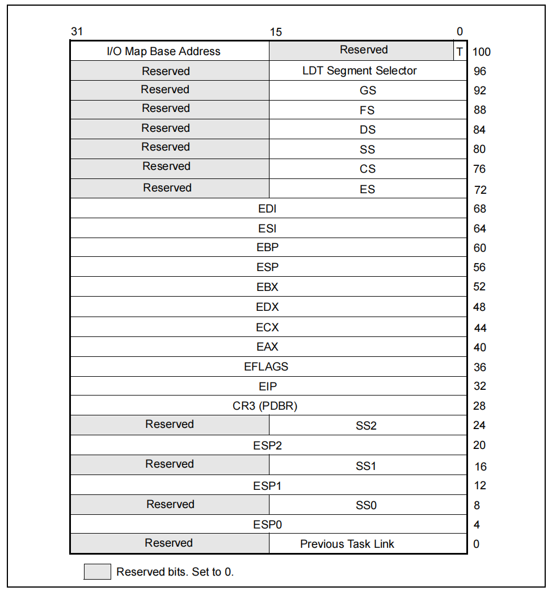
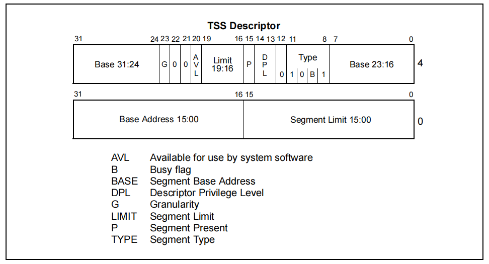
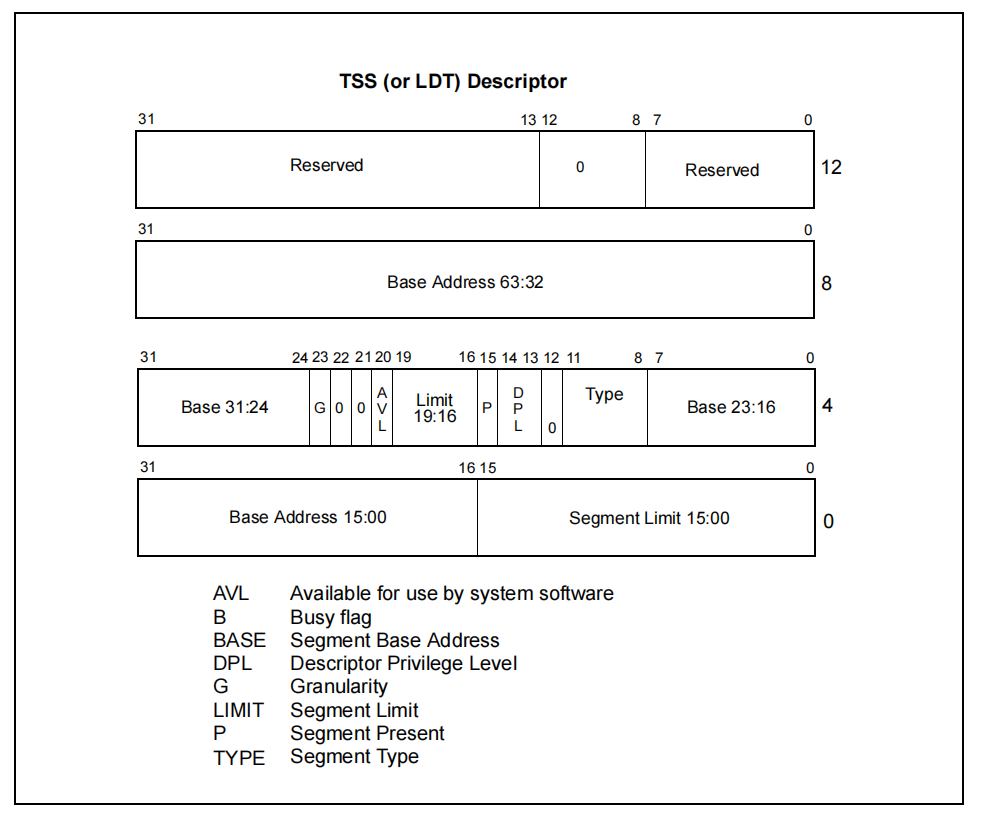
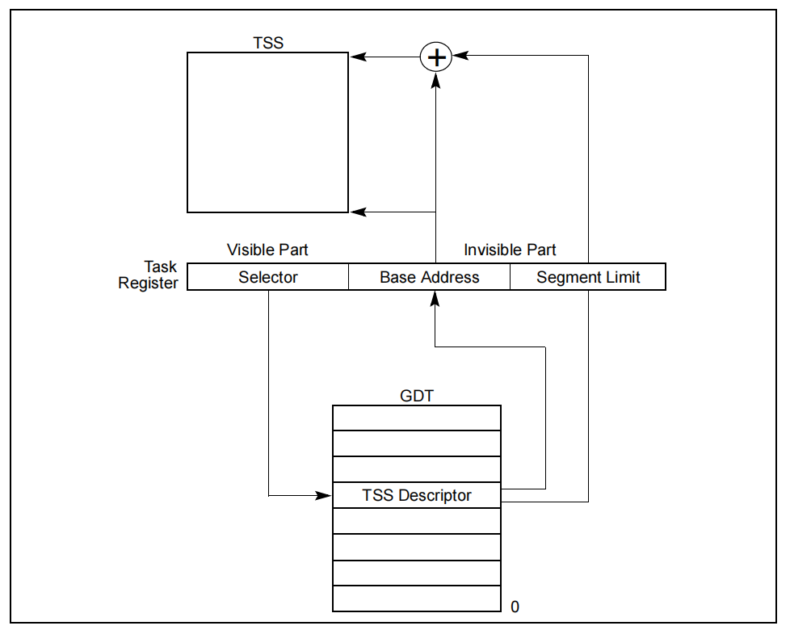
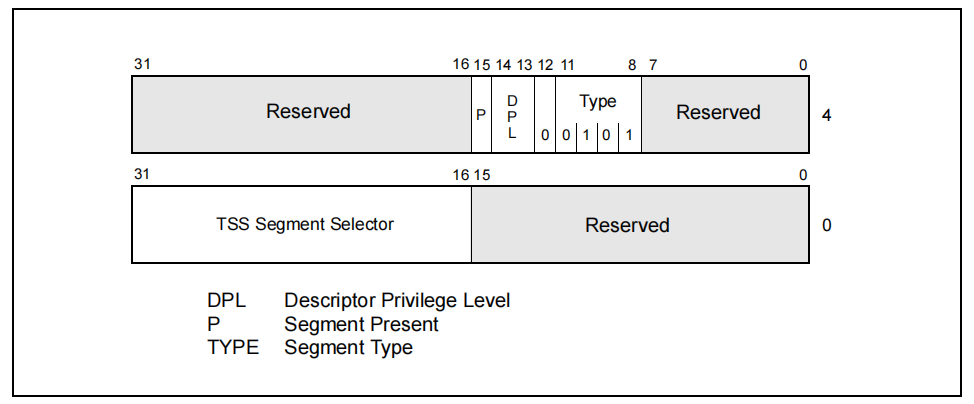
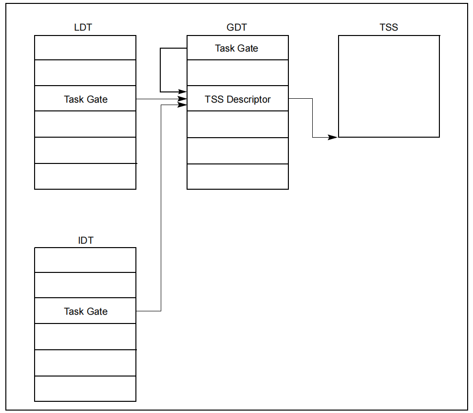
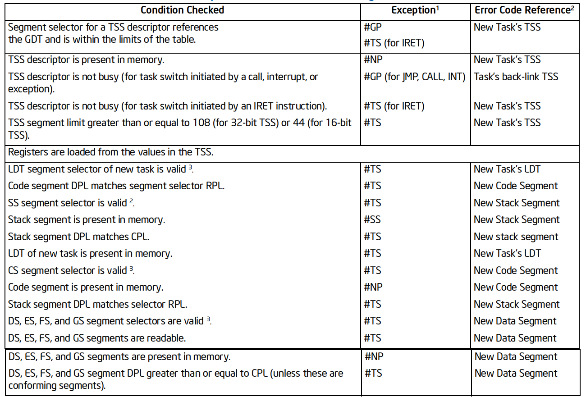
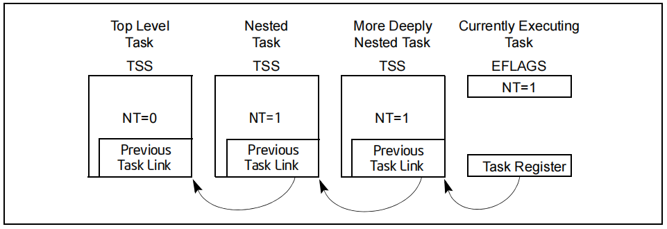
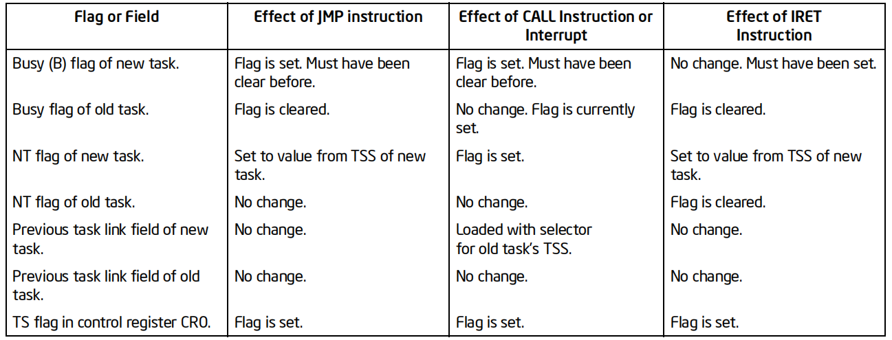
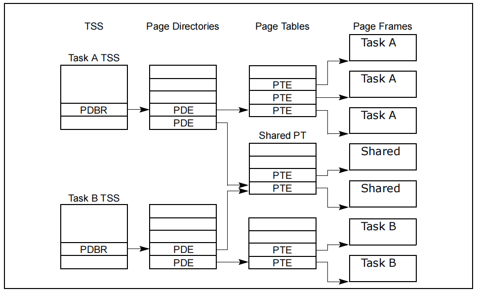

[toc]
# 4. 任务管理

## 4.1. 任务管理概述

任务（Task）是处理器可以分配调度、执行和挂起的一个工作单元。它可用于执行程序、任务或进程、操作系统服务、中断或异常处理过程和内核代码。

80X86 提供了一种机制，这种机制可用来保存任务的状态、分派任务执行以及从一个任务切换到另一个任务。当工作在保护模式下，处理器所有运行都在任务中。即使是简单系统也必须起码定义一个任务。更为复杂的系统可以使用处理器的任务管理功能来支持多任务应用。

80X86 提供了多任务的硬件支持。任务是一个正在运行的程序，或者是一个等待准备运行的程序。通过中断、异常、跳转或调用，我们可以执行一个任务。当这些控制转移形式之一和某个描述符表中指定项的内容一起使用时，那么这个描述符就是一类导致新任务开始执行的描述符。描述符表中与任务相关的描述符有两类：任务状态段描述符和任务门。当执行权传给这任何一类描述符时，都会造成任务切换。

任务切换很象过程调用，但任务切换会保存更多的处理器状态信息。任务切换会把控制权完全转移到一个新的执行环境，即新任务的执行环境。这种转移操作要求保存处理器中几乎所有寄存器的当前内容，包括标志寄存器 EFLAGS 和所有段寄存器。与过程不过，任务不可重入。任务切换不会把任何信息压入堆栈中，处理器的状态信息都被保存在内存中称为任务状态段（Task state segment）的数据结构中。

### 4.1.1. 任务的结构

一个任务由两部分组成：任务执行空间（task execution space）和任务状态段（task-state segment, TSS）。任务执行空间由代码段、堆栈段和一个或多个数据段组成（如下图所示）。如果操作系统或执行程序使用了处理器的特权级别保护机制，那么任务执行空间还将为每个特权级别提供单独的堆栈。

TSS 指定组成任务执行空间的段，并为任务状态信息提供存储的位置。在多任务系统中，TSS 还提供了一种链接任务的机制。

任务由其 TSS 的段选择器标识。当任务加载到处理器中执行时，TSS 的段选择器、基地址、限制和段描述符属性被加载到任务寄存器（Task Register, TR）中。

如果任务实现了分页，那么处理器将任务使用的页目录的基地址加载到控制寄存器CR3中。

### 4.1.2. 任务状态

当前正在执行的任务的状态由处理器所有以下一些内容组成：

- 所有通用寄存器和段寄存器信息；

- 标志寄存器 EFLAGS、程序指针 EIP、控制寄存器 CR3、任务寄存器和 LDTR 寄存器；

- 段寄存器指定的任务当前执行空间；

- I/O 映射位图基地址和 I/O 位图信息（在 TSS 中）；

- 特权级 0、1 和 2 的堆栈指针（在 TSS 中）；

- 链接至前一个任务的链指针（在 TSS 中）。

处理器在分派任务之前，除了任务寄存器的状态，以上其他所有项都包含在任务的 TSS 中。此外， TSS 中并不包含 LDTR 寄存器的完整内容，而仅仅包含 LDT 的段选择器。

### 4.1.3. 任务的执行

软件或处理器可以使用以下方法之一来调度执行一个任务：

- 使用 CALL 指令明确地调用一个任务；

- 使用 JMP 指令明确地跳转到一个任务（Linux 内核使用的方式）；

- （由处理器）隐含地调用一个中断句柄处理任务；

- 隐含地调用一个异常句柄处理任务；

以上所有用于分派任务的方法都使用指向任务门或 TSS 的段选择器，来标识要分派的任务。当使用 CALL 或 JMP 指令调度任务时，指令中的选择器可以直接选用 TSS ，也可以选用保存 TSS 选择器的任务门。当处理器调度任务来处理中断或异常时，中断或异常的 IDT 表项必须包含一个任务门，该门用于保存中断或异常处理程序 TSS 的选择器。

当任务被分派执行时，当前运行的任务和被分派的任务之间会发生任务切换。在任务切换期间，当前执行任务的执行环境（称为任务的状态或上下文(**context**)）保存在其 TSS 中，该任务的执行被暂停。分派任务的上下文被加载到处理器中，然后处理器从新加载的 EIP 寄存器指向的指令开始执行被分派任务。如果自系统上次初始化以来，任务还没有被运行过，那么 EIP 将指向任务代码的第一条指令；否则，EIP 将指向任务上次激活时执行的最后一条指令之后的下一条指令。

如果当前执行的任务（调用的任务）调用正在被分派的任务（被调用的任务），那么调用任务的 TSS 段选择器存储在被调用任务的 TSS 中，以提供返回调用任务的链接。对于所有 IA-32 处理器，任务都不是递归的，即任务不能调用或跳转到自身。

中断或异常可以通过任务切换到中断或异常处理程序任务来处理。处理器执行任务切换以处理中断或异常，并在从中断处理程序任务或异常处理程序任务返回时自动切换回被中断的任务。该机制还可以处理中断任务期间发生的中断。

作为任务切换的一部分，处理器还可以切换到另一个 LDT，并允许每个任务对基于 LDT 的段具有不同的逻辑到物理地址映射。页目录基址寄存器 (CR3) 也会在任务切换时被重新加载，从而允许每个任务都有自己的一组页表。这些保护措施有助于隔离任务，并防止它们相互干扰。

我们可以选择使用任务管理工具来处理多任务应用程序。多任务处理可以在软件中处理，每个软件定义的任务都在单个 IA-32 架构任务的上下文中执行。

## 4.2. 任务的数据结构

处理器定义了以下五种数据结构来处理与任务相关的活动：
• 任务状态段（Task-state segment, TSS）。
• 任务门描述符（Task-gate descriptor）。
• TSS 描述符。
• 任务寄存器（TR）。
• EFLAGS 寄存器中的 NT 标志。

使用这些数据结构，处理器可以从一个任务切换到另一个任务，同时保存原任务的上下文，以允许任务重新执行。

### 4.2.1. 任务状态段（TSS）

恢复任务所需的处理器状态信息被保存在名为任务状态段 (TSS) 的系统段中。下图展示了为 32 位 CPU 设计的任务的 TSS 格式。 TSS 的字段分为两大类：动态字段和静态字段。

1. 动态字段：当任务在任务切换期间挂起时，处理器更新TSS的动态字段（dynamic fields）。以下几项是TSS的动态字段：
   - **通用寄存器字段（General-purpose register fields）**：用于保存 EAX、ECX、EDX、EBX、ESP、EBP、ESI 和 EDI 寄存器的内容。
   - **段选择器字段（Segment selector fields）**：用于保存 ES、CS、SS、DS、FS 和 GS 段寄存器的内容。
   - **标志寄存器 EFLAGS 字段（EFLAGS register field）**：EFLAGS 寄存器在任务切换之前的状态。
   - **指令指针 EIP 字段（EIP (instruction pointer) field）**：任务切换之前 EIP 寄存器的状态。
   - **前一个任务链接字段（Previous task link field）**：含有前一个任务 TSS 段选择符。该字段允许任务使用 IRET 指令切换到前一个任务。

2. 静态字段：TSS的静态字段（static fields）在创建任务时设置，处理器在读取静态字段时通常不会修改它们。以下几项是TSS的静态字段：

   - **LDT 段选择器字段（LDT segment selector field）**：含有任务的 LDT 段的选择符。

   - CR3 控制寄存器字段（CR3 control register field）：包含任务要使用的页面目录的物理基地址。控制寄存器 CR3 也称为页目录基址寄存器 (PDBR)。

   - **特权级为 0、-1 和 -2 的堆栈指针字段（Privilege level -0, -1, and -2 stack pointer fields）：**这些堆栈指针由一个逻辑地址组成，该逻辑地址由堆栈段（SS0、SS1 和 SS2）的段选择器和堆栈中的偏移量（ESP0 、ESP1 和 ESP2）组成。请注意，这些字段中的值对于特定任务是静态的，但如果任务中发生了堆栈切换，SS 和 ESP 值将发生变化。

   - **调试陷阱（Debug Trap）T 标志字段：**设置时，T 标志会导致处理器在从其他任务切换到此任务时引发调试异常。

   - **I/O 位图基地址字段（I/O map base address field）：**该字段包含从 TSS 基址到 I/O 许可位图和中断重定向位图的 16 位偏移量。如果存在，这些映射将存储在 TSS 中的更高地址处。 I/O 映射基地址指向 I/O 权限位图的开始和中断重定向位图的结束位置。

如果使用了分页机制，那么在任务切换期间应该避免处理器操作的 TSS 段中（前 104 字节中）含有内存页边界。如果 TSS 这部分包含内存页边界，那么该边界处两边的页面都必须同时并且连续存在于内存中。另外，如果使用了分页机制，那么与原任务 TSS 和新任务 TSS 相关的页面，以及对应的描述符表表项应该是可读写的。

### 4.2.2. TSS描述符

与所有其他段一样，TSS 由段描述符定义。下图展示了 TSS 描述符的格式。 TSS 描述符只能放在 GDT 中，而不能放在 LDT 或 IDT 中。

类型字段 TYPE 中的忙标志 B 用于指明任务是否处于忙状态。忙状态的任务是当前正在执行的任务或等待执行（被挂起）的任务。值为 0b1001 的类型字段表明任务处于非活动状态；而值为 0b1011 的类型字段表示任务正忙。任务是不可以递归执行的，因此处理器使用忙标志 B 来检测任何企图对被中断执行任务的调用。

其中基地址、段限长、描述符特权级 DPL、颗粒度 G 和存在位具有与数据段描述符中相应字段同样的功能。当 G=0 时，限长字段必须具有等于或大于 103（0x67）的值，即 TSS 段的最小长度不得小于 104 字节。如果 TSS 段中还包含 I/O 许可位图，那么 TSS 段长度需要大一些。另外，如果操作系统还想在 TSS段中存放其他一些信息，那么 TSS 段就需要更大的长度。

使用调用或跳转指令，任何可以访问 TSS 描述符的程序都能够造成任务切换。可以访问 TSS 描述符的程序其 CPL 数值必须小于或等于 TSS 描述符的 DPL。在大多数系统中，TSS 描述符的 DPL 字段值应该设置成小于 3。这样，只有具有特权级的软件可以执行任务切换操作。然而在多任务应用中，某些 TSS 的DPL 可以设置成 3，以使得在用户特权级上也能进行任务切换操作。

可访问一个 TSS 段描述符并没有给程序读写该描述符的能力。若想读或修改一个 TSS 段描述符，可以使用映射到内存相同位置的数据段描述符（即别名描述符）来操作。把 TSS 描述符加载进任何段寄存器将导致一个异常。企图使用 TI 标志置位的选择符（即当前 LDT 中的选择符）来访问 TSS 段也将导致异常。

在大多数系统中，TSS 描述符的 DPL 被设置为小于 3 的值。因此，只有特权级软件（privileged software）才能执行任务切换。但是，在多任务应用程序中，某些 TSS 描述符的 DPL 可能会设置为 3，以允许在应用程序（或用户）特权级别进行任务切换操作。

64位模式不支持任务切换，但 TSS 描述符依然存在。 在 64 位模式下，TSS 描述符扩展为 16 字节（如下图所示）。此扩展也适用于 64 位模式下的 LDT 描述符。

### 4.2.3. 任务寄存器

任务寄存器保存当前任务的 TSS 的 16 位段选择器和整个段描述符。这些信息是从当前任务的 GDT 中的 TSS 描述符复制而来的。下图展示了处理器是如何使用任务寄存器中的信息访问 TSS 的。

任务寄存器中存储的信息有可见的部分（可以通过软件读取和更改）和不可见的部分（由处理器维护，软件无法访问）。可见部分的段选择器指向 GDT 中的一个 TSS 描述符。处理器使用任务寄存器的不可见部分来缓存 TSS 的段描述符，将这些值缓存在寄存器中可以提高任务的执行效率。 LTR（load task register）和STR（store task register）指令加载和读取任务寄存器的可见部分：

1. LTR 指令将段选择器（源操作数）加载到指向 GDT 中的 TSS 描述符的任务寄存器中。然后它使用来自 TSS 描述符的信息加载任务寄存器的不可见部分。 LTR 是一条特权指令，只有在 CPL 为 0 时才能执行。它在系统初始化期间用于将初始值放入任务寄存器中。之后，当发生任务切换时，任务寄存器的内容会被隐式更改。

2. STR 指令将任务寄存器的可见部分存储在通用寄存器或内存中。该指令可以由以任何特权级别运行的代码执行，以识别当前正在运行的任务。但是，它通常仅由操作系统软件使用。

### 4.2.4. 任务门描述符（Task-Gate Descriptor）

任务门描述符提供对任务的间接、受保护的引用（见下图）。它可以放在 GDT、LDT 或 ID 中。任务门描述符中的 TSS 段选择器字段指向 GDT 中的 TSS 描述符。在这种段选择器中并没有使用 RPL。

任务门描述符的 DPL 在任务切换期间控制对 TSS 描述符的访问。当程序或过程通过任务门调用或跳转到任务时，指向任务门的门选择器的 CPL 和 RPL 字段必须小于或等于任务门描述符的 DPL。值得注意的是，当使用任务门时，不会使用目标 TSS 描述符的 DPL。

我们可以通过任务门描述符或 TSS 描述符访问任务。这两种结构都满足以下需求：
- **需要任务只有一个B标志：**因为任务的B标志存储在 TSS 描述符中，每个任务应该只有一个 TSS 描述符。但是，可能有多个任务门引用相同的 TSS 描述符。
- **需要提供对任务的选择性访问：**任务门满足了这一需求，因为它们可以驻留在 LDT 中并且可以具有不同于 TSS 描述符的 DPL 的 DPL。如果一个程序或者过程想要访问一个任务，这个任务的 TSS 描述符保存在 GDT 中，但这个程序或过程（通常 DPL 为 0）并不具有足够的访问权限，那么它可能被允许通过具有更高 DPL 的任务门访问该任务。任务门为操作系统提供了更大的自由度，来限制对特定任务的访问。
- **需要由独立任务处理中断或异常：**任务门也可能位于 IDT 中，它允许中断和异常由处理程序任务处理。当中断或异常向量指向任务门时，处理器切换到指定的任务。

下图展示了 LDT 中的任务门、GDT 中的任务门和 IDT 中的任务门都指向同一个任务的情形。

## 4.3. 任务切换

处理器可使用一下 4 种方式之一执行任务切换操作：
- 当前程序、任务或过程对 GDT 中的 TSS 描述符执行 JMP 或 CALL 指令。
- 当前程序、任务或过程对 GDT 或当前 LDT 中的任务门描述符执行 JMP 或 CALL 指令。
- 中断或异常向量指向 IDT 中的任务门描述符。
- 当前任务在设置 EFLAGS 寄存器中的 NT 标志时执行IRET。

JMP、CALL 和 IRET 指令以及中断和异常都是重定向程序的机制。 TSS 描述符或任务门的引用（调用或跳转到任务时）或 NT 标志的状态（执行 IRET 指令时）决定是否发生任务切换。

处理器在切换到新任务时，执行以下操作：

1. 从作为 JMP 或 CALL 指令操作数中，或者从任务门中，或者从当前 TSS 的前一任务链接字段（对于由 IRET 引起的任务切换）中取得新任务的 TSS 段选择符。
2. 检查是否允许当前（旧）任务切换到新任务。数据访问权限规则适用于 JMP 和 CALL 指令。当前（旧）任务的 CPL 和新任务的段选择器的 RPL 必须小于或等于被引用的 TSS 描述符或任务门的 DPL。异常、中断（由 INT n 指令生成的中断除外）和 IRET 指令允许切换任务，而不管目标任务门或 TSS 描述符的 DPL。对于 INT n 指令产生的中断，需要检查 DPL。
3. 检查新任务的 TSS 描述符是标注为存在的（P=1），并且 TSS 段长度有效（大于 0x67）。当试图执行会产生错误的指令时，都会恢复对处理器状态的任何改变。这使得异常处理过程的返回地址指向出错指令，而非出错指令随后的一条指令。因此异常处理过程可以处理出错条件并且重新执行任务。异常处理过程的介入处理对应用程序来说是完全透明的。
4. 如果任务切换是用 JMP 或 IRET 指令启动的，处理器会清除当前（旧）任务的 TSS 描述符中的 B 标志；如果任务切换是由 CALL 指令、异常或中断产生，则忙标志 B 不动。
5. 如果任务切换是用 IRET 指令启动的，处理器会清除 EFLAGS 寄存器临时保存映像中的 NT 标志；如果使用 CALL 或 JMP 指令、异常或中断启动，则保存的 EFLAGS 映像中的 NT 标志将保持不变。
6. 把当前任务的状态保存到当前任务的 TSS 中。处理器会从任务寄存器中取得当前任务 TSS 的基地址，并且把一下寄存器内容复制到当前 TSS 中：所有通用寄存器、段寄存器中的段选择符、标志寄存器 EFLAGS 以及指令指针 EIP。
7. 如果任务切换是由 CALL 指令、异常或中断产生，则处理器就会把从新任务中加载的 EFLAGS 中的 NT 标志置位。如果任务切换产生自 JMP 或 IRET 指令，就不改动新加载 EFLAGS 中的标志。
8. 如果任务切换由 CALL、JMP 指令或者异常或中断产生，处理器就会设置新任务 TSS 描述符中的忙标志 B。如果任务切换由 IRET 产生，则不去改动 B 标志。
9. 使用新任务 TSS 的段选择符和描述符加载任务寄存器 TR（包括隐藏部分）。设置 CR0 寄存器的TS 标志。
10. 把新任务的 TSS 状态加载进处理器。这包括 LDTR 寄存器、PDBR（CR3）寄存器、EFLAGS 寄存器、EIP 寄存器以及通用寄存器和段选择符。在此期间检测到的任何错误都将出现在新任务的上下文中。
11. 开始执行新任务。

当任务切换成功时，当前正在执行的任务的状态总是被保存。如果任务恢复，则从保存的 EIP 值指向的指令开始执行，并且寄存器恢复到任务暂停时的值。

切换任务时，新任务的权限级别不会继承挂起任务的权限级别。新任务开始以从 TSS 加载的 CS 寄存器的 CPL 字段中指定的特权级别执行。因为任务被它们单独的地址空间和 TSS 隔离，并且因为权限规则控制对 TSS 的访问，所以软件不需要在任务切换时执行显式的权限检查。

下表展示了处理器在切换任务时检查的异常条件。它还展示了为每次检查生成的异常（如果检测到错误）以及错误代码引用的段。 设计用于处理这些异常的异常处理程序可能会受到递归调用，如果它们试图重新加载产生异常的段选择器的话。在重新加载选择器之前，应该修复异常的原因。

每次发生任务切换时，控制寄存器 CR0 中的 TS（任务切换）标志都会被设置。系统软件在与处理器的其余部分产生浮点异常时使用 TS 标志来协调浮点单元的操作。 TS 标志表示浮点单元的上下文可能与当前任务的上下文不同。

## 4.4. 任务链

TSS 的前一个任务链接字段（有时称为“反向链接”）和 EFLAGS 寄存器中的 NT 标志用于将处理器的执行返回到前一个任务。 EFLAGS.NT = 1 表示当前执行的任务嵌套在另一个任务的执行中。

当 CALL 指令、中断或异常导致任务切换时：处理器将当前 TSS 的段选择符复制到新任务的 TSS 的前一个任务链接字段；然后设置 EFLAGS.NT = 1。如果软件使用 IRET 指令暂停新任务，处理器检查 EFLAGS.NT = 1；然后它使用上一个任务链接字段中的值返回到上一个任务。此过程见下图。

当 JMP 指令导致任务切换时，新任务不会嵌套，也就是不会使用先前的任务链接字段且 EFLAGS.NT = 0。因此，当任务不需要嵌套时，使用 JMP 指令分派新任务。

下表总结了任务切换期间，忙标志 B（在 TSS 段描述符中）、NT 标志、前一任务链接字段和 TS 标志（在 CR0 中）的用法。注意，运行于任何特权级上的程序都可以修改 NT 标志，因此任何程序都可以设置 NT 标志并执行 IRET 指令。这种做法会让处理器去执行当前任务 TSS 的前一任务链接字段指定的任务。为了避免这种伪造的任务切换执行成功，操作系统应该把每个 TSS 的该字段初始化为 0。

### 4.4.1. 使用 B 标志来防止递归任务切换

TSS 只允许为一项任务保存一个上下文。因此，一旦调用（分派）任务，对该任务的递归（或重入）调用将导致任务的当前状态丢失。 TSS 段描述符中的 B 标志用于防止重入任务切换和随后的任务状态信息丢失。处理器按如下方式管理 B 标志：

1. 调度任务时，处理器设置新任务的 B 标志。
2. 如果在任务切换期间，当前任务被放置在嵌套链中（任务切换由 CALL 指令、中断或异常生成），则当前任务的 B 标志保持设置。
3. 当切换到新任务（由 CALL 指令、中断或异常启动）时，如果新任务的 B 标志已设置，则处理器会生成通用保护异常 (#GP)。如果使用 IRET 指令启动任务切换，则不会引发异常，因为处理器希望设置 B 标志。
4. 当一个任务被跳转到一个新任务（由任务代码中的 JMP 指令启动）或任务代码中的 IRET 指令终止时，处理器清除 B 标志，将任务返回到“不忙”状态。

处理器通过防止任务切换到自身或嵌套任务链中的任何任务来防止递归任务切换。由于多次调用、中断或异常，嵌套的挂起任务链可能会增长到任意长度。如果任务在此链中，则 B 标志会阻止调用该任务。

B 标志可用于多处理器配置，因为处理器在设置或清除 B 标志时遵循 LOCK 协议（在总线上或缓存中）。这个锁可以防止两个处理器同时调用同一个任务。

### 4.4.2. 修改任务链接

在单处理器系统中，如果需要从链接任务链中删除任务，那么使用以下过程来删除任务：

1. 关中断。
2. 改变抢占任务（挂起待移除任务的任务）TSS中的previous task link字段。假设抢占任务是链中要删除的任务的下一个任务（较新的任务）。将先前的任务链接字段更改为指向链中下一个最旧任务的 TSS，或者指向链中更旧的任务。
3. 为从链中移除的任务清除 TSS 段描述符中的 B 标志。如果从链中删除了多个任务，则必须清除每个正在删除的任务的 B 标志。
4. 开中断。

在多处理系统中，必须向此过程添加额外的同步和序列化操作，以确保在更改先前的任务链接字段并清除 B 标志时，TSS 及其段描述符都被锁定。

## 4.5. 任务地址空间

任务的地址空间由任务可以访问的段组成。这些段包括 TSS 中引用的代码、数据、堆栈和系统段以及任务代码访问的任何其他段。这些段被映射到处理器的线性地址空间，而线性地址空间又被映射到处理器的物理地址空间（直接或通过分页）。

TSS 中的 LDT 字段可以用于给出每个任务自己的 LDT。对于一个给定的任务，通过把与任务相关的所有段描述符放入 LDT 中，任务的地址空间就可以与其他任务的隔绝开来。

当然，几个任务也可以使用同一个 LDT。这是一种简单而有效的允许某些任务互相通信或控制的方法，而无须抛弃整个系统的保护屏障。

因为所有任务都可以访问 GDT，所以也同样可以创建通过此表访问的共享段。

如果开启了分页机制，则 TSS 中的 CR3 寄存器字段可以让每个任务有它自己的页表。或者，几个任务能够共享相同页表集。

### 4.5.1. 将任务映射到线性和物理地址空间

可以通过以下两种方式之一将任务映射到线性地址空间和物理地址空间：
- **所有任务共享一个线性到物理地址空间映射。** 未启用分页时，这是唯一的选择。在没有分页的情况下，所有线性地址都映射到相同的物理地址。当启用分页时，这种形式的线性到物理地址空间映射是通过对所有任务使用一个页面目录来获得的。如果支持请求分页的虚拟内存，那么线性地址空间可能会超过可用的物理空间。
- **每个任务都有自己的映射到物理地址空间的线性地址空间。** 这种形式的映射是通过为每个任务使用不同的页面目录来完成的。因为PDBR（控制寄存器CR3）加载在任务开关上，每个任务可能有不同的页目录。

不同任务的线性地址空间可能映射到完全不同的物理地址。如果不同页目录的条目指向不同的页表，而页表又指向物理内存的不同页，那么任务不共享物理地址。

对于映射任务线性地址空间的这两种方法，所有任务的 TSS 都必须存放在共享的物理地址空间区域中，并且所有任务都能访问这个区域。为了让处理器执行任务切换而读取或更新 TSS 时，TSS 地址的映射不会改变，就需要使用这种映射方式。GDT 所映射的线性地址空间也应该映射到共享的物理地址空间中。否则就丧失了 GDT 的作用。

下图展示了两个任务的线性地址空间如何通过共享页表在物理空间中重叠。

### 4.5.2. 任务逻辑地址空间

要允许在任务之间共享数据，需要使用以下技术为数据段创建共享的逻辑到物理地址空间映射：
- **通过GDT 中的段描述符：**所有任务都必须能够访问 GDT 中的段描述符。如果 GDT 中的某些段描述符指向线性地址空间中的段，这些段映射到所有任务共有的物理地址空间区域，那么所有任务都可以共享这些段中的数据和代码。
- **通过共享LDT：**如果两个或多个任务的TSS 中的 LDT 字段指向同一个LDT，那么两个或多个任务可以使用同一个 LDT。如果共享 LDT 中的某些段描述符指向映射到物理地址空间公共区域的段，则这些段中的数据和代码可以在共享 LDT 的任务之间共享。这种共享方法比通过 GDT 共享更加值得选择，因为共享可以限于特定任务。系统中的其他任务可能有不同的 LDT，而这些 LDT 不允许它们访问共享段。
- **通过不同 LDT 中的段描述符映射到线性地址空间中的公共地址：**如果线性地址空间的这个公共区域映射到每个任务的物理地址空间的相同区域，这些段描述符允许任务共享段。这样的段描述符通常称为别名。这种共享方法比上面列出的方法更加值得选择，因为 LDT 中的其他段描述符可能指向不共享的独立线性地址。